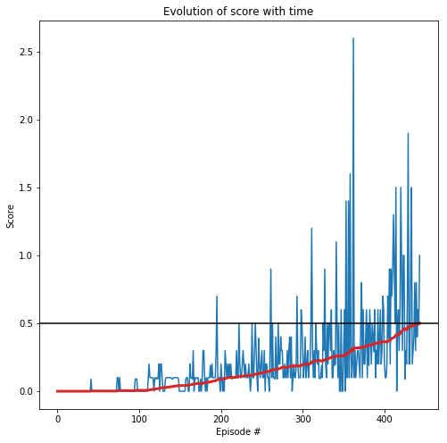

# Collaboration and Competition

---

You are welcome to use this coding environment to train your agent for the project.  Follow the instructions below to get started!

### 1. Start the Environment

Please see the README.md file for information on how to install all the necessary packages for this project.

# Setup 1: Use the following cell for running on local computer

For instructions on how to install unityagents please see the README.md file.


```python
#from unityagents import UnityEnvironment
#import numpy as np

#env = UnityEnvironment(file_name="Tennis.app")
```

# Setup 2: Use the following two cells for running on Udacity Workspace

The Udacity workspace is pre-configured so that the notebook will execute just fine.


```python
#!pip -q install ./python
```

    tensorflow 1.7.1 has requirement numpy>=1.13.3, but you'll have numpy 1.12.1 which is incompatible.
    ipython 6.5.0 has requirement prompt-toolkit<2.0.0,>=1.0.15, but you'll have prompt-toolkit 3.0.5 which is incompatible.


```python
#from unityagents import UnityEnvironment
#import numpy as np

#env = UnityEnvironment(file_name="/data/Tennis_Linux_NoVis/Tennis")
```

    INFO:unityagents:
    'Academy' started successfully!
    Unity Academy name: Academy
            Number of Brains: 1
            Number of External Brains : 1
            Lesson number : 0
            Reset Parameters :
    		
    Unity brain name: TennisBrain
            Number of Visual Observations (per agent): 0
            Vector Observation space type: continuous
            Vector Observation space size (per agent): 8
            Number of stacked Vector Observation: 3
            Vector Action space type: continuous
            Vector Action space size (per agent): 2
            Vector Action descriptions: , 


# After Setup continue from here with all cells in the notebook

Environments contain **_brains_** which are responsible for deciding the actions of their associated agents. Here we check for the first brain available, and set it as the default brain we will be controlling from Python.


```python
# get the default brain
brain_name = env.brain_names[0]
brain = env.brains[brain_name]
```

### 2. Examine the State and Action Spaces

Run the code cell below to print some information about the environment.


```python
# reset the environment
env_info = env.reset(train_mode=True)[brain_name]

# number of agents 
num_agents = len(env_info.agents)
print('Number of agents:', num_agents)

# size of each action
action_size = brain.vector_action_space_size
print('Size of each action:', action_size)

# examine the state space 
states = env_info.vector_observations
state_size = states.shape[1]
print('There are {} agents. Each observes a state with length: {}'.format(states.shape[0], state_size))
print('The state for the first agent looks like:', states[0])
print('The state for the second agent looks like:', states[1])
```

    Number of agents: 2
    Size of each action: 2
    There are 2 agents. Each observes a state with length: 24
    The state for the first agent looks like: [ 0.          0.          0.          0.          0.          0.          0.
      0.          0.          0.          0.          0.          0.          0.
      0.          0.         -6.65278625 -1.5        -0.          0.
      6.83172083  6.         -0.          0.        ]
    The state for the second agent looks like: [ 0.          0.          0.          0.          0.          0.          0.
      0.          0.          0.          0.          0.          0.          0.
      0.          0.         -6.4669857  -1.5         0.          0.
     -6.83172083  6.          0.          0.        ]


### 3. Take Random Actions in the Environment

In the next code cell, you will learn how to use the Python API to control the agent and receive feedback from the environment.

Note that **in this coding environment, you will not be able to watch the agents while they are training**, and you should set `train_mode=True` to restart the environment.


```python
for i in range(2):                                         # play game for 5 episodes
    env_info = env.reset(train_mode=False)[brain_name]     # reset the environment    
    states = env_info.vector_observations                  # get the current state (for each agent)
    scores = np.zeros(num_agents)                          # initialize the score (for each agent)
    while True:
        actions = np.random.randn(num_agents, action_size) # select an action (for each agent)
        actions = np.clip(actions, -1, 1)                  # all actions between -1 and 1
        env_info = env.step(actions)[brain_name]           # send all actions to tne environment
        next_states = env_info.vector_observations         # get next state (for each agent)
        rewards = env_info.rewards                         # get reward (for each agent)
        dones = env_info.local_done                        # see if episode finished
        scores += env_info.rewards                         # update the score (for each agent)
        states = next_states                               # roll over states to next time step
        if np.any(dones):                                  # exit loop if episode finished
            break
    print('Total score (averaged over agents) this episode: {}'.format(np.mean(scores)))
```

    Total score (averaged over agents) this episode: -0.004999999888241291
    Total score (averaged over agents) this episode: -0.004999999888241291


### 4. It's Your Turn!

Now it's your turn to train your own agent to solve the environment!  A few **important notes**:
- When training the environment, set `train_mode=True`, so that the line for resetting the environment looks like the following:
```python
env_info = env.reset(train_mode=True)[brain_name]
```
- To structure your work, you're welcome to work directly in this Jupyter notebook, or you might like to start over with a new file!  You can see the list of files in the workspace by clicking on **_Jupyter_** in the top left corner of the notebook.
- In this coding environment, you will not be able to watch the agents while they are training.  However, **_after training the agents_**, you can download the saved model weights to watch the agents on your own machine! 

# Collaboration and Competition - Project Results

The following sections show my cresults from my work on this project.
In the first submission, my code was very similar to my solution of the second project, the Reacher environment with 20 agents.
In the second submissions, I follow more software engineering guidelines and have split the code into several independent files.
In both cases, the structure and basic algorithms were also discussed in the Udacity Coruse Lectures, such as the DDPG bipedal walker or the pendulum environments.

I have implemented an Actor-Critic set-up with a DDPG algorithm:

Implementation is pretty straight-forward and can be seen in the file **network.py**:

 - Actor neural network with three fully connected layers with sizes of: 24 (states) -> 256 (hidden) -> 128 (hidden) -> 2 (action value)
 - Critic neural network with three fully connected layers with sizes of: 24 (states) -> 256 (hidden) + 2 (action values) -> 128 (hidden) -> 1 (Q-value)
 - Please note that at the first hidden layer of the Critic network, the action values are merged

Both neural network architectures implement:

 - Linear fully connected layers: https://pytorch.org/docs/master/generated/torch.nn.Linear.html
 - Leaky rectangular linear unit activation function: https://pytorch.org/docs/stable/nn.html
 - Batch Normalization on input to regularize input data: https://pytorch.org/docs/master/generated/torch.nn.BatchNorm1d.html

I have implemented an agent in the file **agent.py** with:

 - Experience replay with random sampling (see file **replay_buffer.py**)
 - Ornstein-Uhlenbeck process for noise on action value (see file **noise_generator.py**)
 - Mean-squared-error loss functions
 - Adam optimizer: https://pytorch.org/docs/stable/_modules/torch/optim/adam.html#Adam
 - Several learning passes per step of agent
 
The final training is then executed by a Deep Deterministic Policy Gradient Algorithm (see file: **ddpg.py**).

Note that these implementations give room for many more advanced changes, which of some will be discussed in the final conclusions section.

I evolve the learning process until the mean score of the last 100 episodes reaches a value of greater than 0.5. Then the training process is stopped and the result are prepared for output and plotting.

### Setting of variables for the neural network, training algorithms and unity environments

The configuration class is given in this notebook, as to provide a good documentation of the hyperparameters for the report.


```python
class Config:
    """Configuration class for this project."""
    
    def __init__(self, device):
        """Initialize constants and (hyper)parameters.
        Params
        ======
            See the list below for all network, agent and training parameters.
            For code execution of this project the parameter names are required to be unchanged.
            The values of the parameters can be changed and the parameter space explored.

            device (torch.device): String indicating if GPU or CPU is used
        """
        
        super(Config, self).__init__()
        
        self.buffer_size = int(1e6)     # replay buffer size
        self.batch_size = 256           # minibatch size
        self.gamma = 0.99               # discount factor
        self.tau = 0.0015               # for soft update of target parameters
        self.lr_actor = 0.0002          # learning rate for actor network
        self.lr_critic = 0.001          # learning rate for critic network

        self.fc_size = 32               # number of neurons in layer of neural network

        self.action_size = brain.vector_action_space_size # number of actions
        self.state_size = states.shape[1]    # number of states
        self.n_agents = len(env_info.agents) # number of agents

        self.n_episodes = 2000          # number of maximum episodes for training
        self.num_passes = 5             # Number of learning passes per step
        self.env_solved = 0.5           # average score of agent to consider environment solved
   
        self.seed_buffer = 27           # seed integer for random number of replay buffer
        self.seed_noise = 27            # seed integer for random number of noise process
        self.seed_actor = 27            # seed integer for random number of actor network
        self.seed_critic = 27           # seed integer for random number of critic network
        self.seed_agent = 27            # seed integer for random number of agent
        
        self.device = device            # Device for training (CPU or GPU)
        
        self.mu = 0.0                   # Mu of OUNoise process
        self.theta = 0.15               # Theta of OUNoise process
        self.sigma = 0.1                # Sigma of OUNoise process
        self.gauss_mu = 0.0             # Mean of noise distribution
        self.gauss_sigma = 1.0          # Standard deviation of noise distribution
```

### Check if training on GPU is possible, else use CPU


```python
import torch
```


```python
device = torch.device("cuda:0" if torch.cuda.is_available() else "cpu") # Training on CPU or GPU

if device == "cpu":
    print("Available: CPU only")
else:
    print("Available: GPU cuda")
```

    Available: GPU cuda


### Initialize configuration


```python
config = Config(device)
```

### Create instance agent for current run


```python
from source.agent import ActorCritic
agent = ActorCritic(config)
```

### Main Loop

In the following cell the program is executed. The agent architecture is subsequently trained and the weights of the final solution as well as the time evolution of average reward are stored into files.

### Training of agent with deep deterministic policy gradient

Algorithm loops over a number of eposiodes with maximum of N_EPISODES=5000, each for a time until the ball has dropped onto the ground:

 - Every episode the current score and the average score (last 100 episodes) is print on console
 - Every 20 episodes the weights and scores are temporarily written into a file
 - The environment is considered solved if the average score (of all agents) is greater than 0.50 for the last 100 episodes
 - If the environment is solved, the training is stopped and the final weights are written in a file


```python
# Import training algorithm
from source.ddpg import ddpg

# Import to keep notebook instance active while training 
import source.workspace_utils
from source.workspace_utils import active_session
```


```python
print("\nTraining Loop:\n")

with active_session():
    scores, scores_avg = ddpg(agent, config, env)
```

    
    Training Loop:
    
    Episode 1	Current Score: 0.0000	Average Score: 0.0000
    Episode 2	Current Score: 0.0000	Average Score: 0.0000
    Episode 3	Current Score: 0.0000	Average Score: 0.0000
    Episode 4	Current Score: 0.0000	Average Score: 0.0000
    Episode 5	Current Score: 0.0000	Average Score: 0.0000
    Episode 6	Current Score: 0.0000	Average Score: 0.0000
    Episode 7	Current Score: 0.0000	Average Score: 0.0000
    Episode 8	Current Score: 0.0000	Average Score: 0.0000
    Episode 9	Current Score: 0.0000	Average Score: 0.0000
    Episode 10	Current Score: 0.0000	Average Score: 0.0000
    Episode 11	Current Score: 0.0000	Average Score: 0.0000
    Episode 12	Current Score: 0.0000	Average Score: 0.0000
    Episode 13	Current Score: 0.0000	Average Score: 0.0000
    Episode 14	Current Score: 0.0000	Average Score: 0.0000
    Episode 15	Current Score: 0.0000	Average Score: 0.0000
    Episode 16	Current Score: 0.0000	Average Score: 0.0000
    Episode 17	Current Score: 0.0000	Average Score: 0.0000
    Episode 18	Current Score: 0.0000	Average Score: 0.0000
    Episode 19	Current Score: 0.0000	Average Score: 0.0000
    Episode 20	Current Score: 0.0000	Average Score: 0.0000
    Episode 21	Current Score: 0.0000	Average Score: 0.0000
    Episode 22	Current Score: 0.0000	Average Score: 0.0000
    Episode 23	Current Score: 0.0000	Average Score: 0.0000
    Episode 24	Current Score: 0.0000	Average Score: 0.0000
    Episode 25	Current Score: 0.0000	Average Score: 0.0000
    Episode 26	Current Score: 0.0000	Average Score: 0.0000
    Episode 27	Current Score: 0.0000	Average Score: 0.0000
    Episode 28	Current Score: 0.0000	Average Score: 0.0000
    Episode 29	Current Score: 0.0000	Average Score: 0.0000
    Episode 30	Current Score: 0.0000	Average Score: 0.0000
    Episode 31	Current Score: 0.0000	Average Score: 0.0000
    Episode 32	Current Score: 0.0000	Average Score: 0.0000
    Episode 33	Current Score: 0.0000	Average Score: 0.0000
    Episode 34	Current Score: 0.0000	Average Score: 0.0000
    Episode 35	Current Score: 0.0000	Average Score: 0.0000
    Episode 36	Current Score: 0.0000	Average Score: 0.0000
    Episode 37	Current Score: 0.0000	Average Score: 0.0000
    Episode 38	Current Score: 0.0000	Average Score: 0.0000
    Episode 39	Current Score: 0.0000	Average Score: 0.0000
    Episode 40	Current Score: 0.0000	Average Score: 0.0000
    Episode 41	Current Score: 0.0000	Average Score: 0.0000
    Episode 42	Current Score: 0.0900	Average Score: 0.0021
    Episode 43	Current Score: 0.0000	Average Score: 0.0021
    Episode 44	Current Score: 0.0000	Average Score: 0.0020
    Episode 45	Current Score: 0.0000	Average Score: 0.0020
    Episode 46	Current Score: 0.0000	Average Score: 0.0020
    Episode 47	Current Score: 0.0000	Average Score: 0.0019
    Episode 48	Current Score: 0.0000	Average Score: 0.0019
    Episode 49	Current Score: 0.0000	Average Score: 0.0018
    Episode 50	Current Score: 0.0000	Average Score: 0.0018
    Episode 51	Current Score: 0.0000	Average Score: 0.0018
    Episode 52	Current Score: 0.0000	Average Score: 0.0017
    Episode 53	Current Score: 0.0000	Average Score: 0.0017
    Episode 54	Current Score: 0.0000	Average Score: 0.0017
    Episode 55	Current Score: 0.0000	Average Score: 0.0016
    Episode 56	Current Score: 0.0000	Average Score: 0.0016
    Episode 57	Current Score: 0.0000	Average Score: 0.0016
    Episode 58	Current Score: 0.0000	Average Score: 0.0016
    Episode 59	Current Score: 0.0000	Average Score: 0.0015
    Episode 60	Current Score: 0.0000	Average Score: 0.0015
    Episode 61	Current Score: 0.0000	Average Score: 0.0015
    Episode 62	Current Score: 0.0000	Average Score: 0.0015
    Episode 63	Current Score: 0.0000	Average Score: 0.0014
    Episode 64	Current Score: 0.0000	Average Score: 0.0014
    Episode 65	Current Score: 0.0000	Average Score: 0.0014
    Episode 66	Current Score: 0.0000	Average Score: 0.0014
    Episode 67	Current Score: 0.0000	Average Score: 0.0013
    Episode 68	Current Score: 0.0000	Average Score: 0.0013
    Episode 69	Current Score: 0.0000	Average Score: 0.0013
    Episode 70	Current Score: 0.0000	Average Score: 0.0013
    Episode 71	Current Score: 0.0000	Average Score: 0.0013
    Episode 72	Current Score: 0.0000	Average Score: 0.0013
    Episode 73	Current Score: 0.0000	Average Score: 0.0012
    Episode 74	Current Score: 0.1000	Average Score: 0.0026
    Episode 75	Current Score: 0.1000	Average Score: 0.0039
    Episode 76	Current Score: 0.0000	Average Score: 0.0038
    Episode 77	Current Score: 0.1000	Average Score: 0.0051
    Episode 78	Current Score: 0.0000	Average Score: 0.0050
    Episode 79	Current Score: 0.0000	Average Score: 0.0049
    Episode 80	Current Score: 0.0000	Average Score: 0.0049
    Episode 81	Current Score: 0.0000	Average Score: 0.0048
    Episode 82	Current Score: 0.0000	Average Score: 0.0048
    Episode 83	Current Score: 0.0000	Average Score: 0.0047
    Episode 84	Current Score: 0.0000	Average Score: 0.0046
    Episode 85	Current Score: 0.0000	Average Score: 0.0046
    Episode 86	Current Score: 0.0000	Average Score: 0.0045
    Episode 87	Current Score: 0.0000	Average Score: 0.0045
    Episode 88	Current Score: 0.0000	Average Score: 0.0044
    Episode 89	Current Score: 0.0000	Average Score: 0.0044
    Episode 90	Current Score: 0.0000	Average Score: 0.0043
    Episode 91	Current Score: 0.0000	Average Score: 0.0043
    Episode 92	Current Score: 0.0000	Average Score: 0.0042
    Episode 93	Current Score: 0.0000	Average Score: 0.0042
    Episode 94	Current Score: 0.0000	Average Score: 0.0041
    Episode 95	Current Score: 0.0000	Average Score: 0.0041
    Episode 96	Current Score: 0.0900	Average Score: 0.0050
    Episode 97	Current Score: 0.0900	Average Score: 0.0059
    Episode 98	Current Score: 0.0900	Average Score: 0.0067
    Episode 99	Current Score: 0.0000	Average Score: 0.0067
    Episode 100	Current Score: 0.0000	Average Score: 0.0066
    Episode 101	Current Score: 0.0000	Average Score: 0.0066
    Episode 102	Current Score: 0.0000	Average Score: 0.0066
    Episode 103	Current Score: 0.0000	Average Score: 0.0066
    Episode 104	Current Score: 0.0000	Average Score: 0.0066
    Episode 105	Current Score: 0.0000	Average Score: 0.0066
    Episode 106	Current Score: 0.0000	Average Score: 0.0066
    Episode 107	Current Score: 0.0000	Average Score: 0.0066
    Episode 108	Current Score: 0.0000	Average Score: 0.0066
    Episode 109	Current Score: 0.0000	Average Score: 0.0066
    Episode 110	Current Score: 0.0000	Average Score: 0.0066
    Episode 111	Current Score: 0.0000	Average Score: 0.0066
    Episode 112	Current Score: 0.1000	Average Score: 0.0076
    Episode 113	Current Score: 0.2000	Average Score: 0.0096
    Episode 114	Current Score: 0.1000	Average Score: 0.0106
    Episode 115	Current Score: 0.1000	Average Score: 0.0116
    Episode 116	Current Score: 0.1000	Average Score: 0.0126
    Episode 117	Current Score: 0.1000	Average Score: 0.0136
    Episode 118	Current Score: 0.0900	Average Score: 0.0145
    Episode 119	Current Score: 0.0000	Average Score: 0.0145
    Episode 120	Current Score: 0.1000	Average Score: 0.0155
    Episode 121	Current Score: 0.0900	Average Score: 0.0164
    Episode 122	Current Score: 0.1000	Average Score: 0.0174
    Episode 123	Current Score: 0.0900	Average Score: 0.0183
    Episode 124	Current Score: 0.1000	Average Score: 0.0193
    Episode 125	Current Score: 0.2000	Average Score: 0.0213
    Episode 126	Current Score: 0.0000	Average Score: 0.0213
    Episode 127	Current Score: 0.2000	Average Score: 0.0233
    Episode 128	Current Score: 0.2000	Average Score: 0.0253
    Episode 129	Current Score: 0.1000	Average Score: 0.0263
    Episode 130	Current Score: 0.0000	Average Score: 0.0263
    Episode 131	Current Score: 0.0000	Average Score: 0.0263
    Episode 132	Current Score: 0.0000	Average Score: 0.0263
    Episode 133	Current Score: 0.0900	Average Score: 0.0272
    Episode 134	Current Score: 0.1000	Average Score: 0.0282
    Episode 135	Current Score: 0.1000	Average Score: 0.0292
    Episode 136	Current Score: 0.1000	Average Score: 0.0302
    Episode 137	Current Score: 0.1000	Average Score: 0.0312
    Episode 138	Current Score: 0.1000	Average Score: 0.0322
    Episode 139	Current Score: 0.1000	Average Score: 0.0332
    Episode 140	Current Score: 0.1000	Average Score: 0.0342
    Episode 141	Current Score: 0.0900	Average Score: 0.0351
    Episode 142	Current Score: 0.0900	Average Score: 0.0351
    Episode 143	Current Score: 0.1000	Average Score: 0.0361
    Episode 144	Current Score: 0.1000	Average Score: 0.0371
    Episode 145	Current Score: 0.1000	Average Score: 0.0381
    Episode 146	Current Score: 0.1000	Average Score: 0.0391
    Episode 147	Current Score: 0.1000	Average Score: 0.0401
    Episode 148	Current Score: 0.1000	Average Score: 0.0411
    Episode 149	Current Score: 0.0900	Average Score: 0.0420
    Episode 150	Current Score: 0.0000	Average Score: 0.0420
    Episode 151	Current Score: 0.0000	Average Score: 0.0420
    Episode 152	Current Score: 0.0000	Average Score: 0.0420
    Episode 153	Current Score: 0.0000	Average Score: 0.0420
    Episode 154	Current Score: 0.0000	Average Score: 0.0420
    Episode 155	Current Score: 0.0000	Average Score: 0.0420
    Episode 156	Current Score: 0.0000	Average Score: 0.0420
    Episode 157	Current Score: 0.0000	Average Score: 0.0420
    Episode 158	Current Score: 0.0900	Average Score: 0.0429
    Episode 159	Current Score: 0.1000	Average Score: 0.0439
    Episode 160	Current Score: 0.1000	Average Score: 0.0449
    Episode 161	Current Score: 0.0000	Average Score: 0.0449
    Episode 162	Current Score: 0.0000	Average Score: 0.0449
    Episode 163	Current Score: 0.2000	Average Score: 0.0469
    Episode 164	Current Score: 0.1000	Average Score: 0.0479
    Episode 165	Current Score: 0.1000	Average Score: 0.0489
    Episode 166	Current Score: 0.0900	Average Score: 0.0498
    Episode 167	Current Score: 0.3000	Average Score: 0.0528
    Episode 168	Current Score: 0.0000	Average Score: 0.0528
    Episode 169	Current Score: 0.1000	Average Score: 0.0538
    Episode 170	Current Score: 0.0900	Average Score: 0.0547
    Episode 171	Current Score: 0.1000	Average Score: 0.0557
    Episode 172	Current Score: 0.1000	Average Score: 0.0567
    Episode 173	Current Score: 0.1000	Average Score: 0.0577
    Episode 174	Current Score: 0.0000	Average Score: 0.0567
    Episode 175	Current Score: 0.0000	Average Score: 0.0557
    Episode 176	Current Score: 0.0900	Average Score: 0.0566
    Episode 177	Current Score: 0.0000	Average Score: 0.0556
    Episode 178	Current Score: 0.0900	Average Score: 0.0565
    Episode 179	Current Score: 0.3000	Average Score: 0.0595
    Episode 180	Current Score: 0.3000	Average Score: 0.0625
    Episode 181	Current Score: 0.1000	Average Score: 0.0635
    Episode 182	Current Score: 0.0000	Average Score: 0.0635
    Episode 183	Current Score: 0.1000	Average Score: 0.0645
    Episode 184	Current Score: 0.0000	Average Score: 0.0645
    Episode 185	Current Score: 0.1000	Average Score: 0.0655
    Episode 186	Current Score: 0.1000	Average Score: 0.0665
    Episode 187	Current Score: 0.1000	Average Score: 0.0675
    Episode 188	Current Score: 0.1900	Average Score: 0.0694
    Episode 189	Current Score: 0.1000	Average Score: 0.0704
    Episode 190	Current Score: 0.2000	Average Score: 0.0724
    Episode 191	Current Score: 0.1000	Average Score: 0.0734
    Episode 192	Current Score: 0.1000	Average Score: 0.0744
    Episode 193	Current Score: 0.1000	Average Score: 0.0754
    Episode 194	Current Score: 0.1000	Average Score: 0.0764
    Episode 195	Current Score: 0.3000	Average Score: 0.0794
    Episode 196	Current Score: 0.7000	Average Score: 0.0855
    Episode 197	Current Score: 0.1000	Average Score: 0.0856
    Episode 198	Current Score: 0.1000	Average Score: 0.0857
    Episode 199	Current Score: 0.1000	Average Score: 0.0867
    Episode 200	Current Score: 0.0000	Average Score: 0.0867
    Episode 201	Current Score: 0.2000	Average Score: 0.0887
    Episode 202	Current Score: 0.1000	Average Score: 0.0897
    Episode 203	Current Score: 0.0000	Average Score: 0.0897
    Episode 204	Current Score: 0.1000	Average Score: 0.0907
    Episode 205	Current Score: 0.0000	Average Score: 0.0907
    Episode 206	Current Score: 0.3000	Average Score: 0.0937
    Episode 207	Current Score: 0.2000	Average Score: 0.0957
    Episode 208	Current Score: 0.1000	Average Score: 0.0967
    Episode 209	Current Score: 0.2000	Average Score: 0.0987
    Episode 210	Current Score: 0.1000	Average Score: 0.0997
    Episode 211	Current Score: 0.2000	Average Score: 0.1017
    Episode 212	Current Score: 0.1000	Average Score: 0.1017
    Episode 213	Current Score: 0.2000	Average Score: 0.1017
    Episode 214	Current Score: 0.0900	Average Score: 0.1016
    Episode 215	Current Score: 0.1000	Average Score: 0.1016
    Episode 216	Current Score: 0.1000	Average Score: 0.1016
    Episode 217	Current Score: 0.1000	Average Score: 0.1016
    Episode 218	Current Score: 0.1000	Average Score: 0.1017
    Episode 219	Current Score: 0.1000	Average Score: 0.1027
    Episode 220	Current Score: 0.3000	Average Score: 0.1047
    Episode 221	Current Score: 0.1000	Average Score: 0.1048
    Episode 222	Current Score: 0.1000	Average Score: 0.1048
    Episode 223	Current Score: 0.5000	Average Score: 0.1089
    Episode 224	Current Score: 0.2000	Average Score: 0.1099
    Episode 225	Current Score: 0.1000	Average Score: 0.1089
    Episode 226	Current Score: 0.1000	Average Score: 0.1099
    Episode 227	Current Score: 0.2000	Average Score: 0.1099
    Episode 228	Current Score: 0.3000	Average Score: 0.1109
    Episode 229	Current Score: 0.2000	Average Score: 0.1119
    Episode 230	Current Score: 0.1000	Average Score: 0.1129
    Episode 231	Current Score: 0.2000	Average Score: 0.1149
    Episode 232	Current Score: 0.1000	Average Score: 0.1159
    Episode 233	Current Score: 0.1000	Average Score: 0.1160
    Episode 234	Current Score: 0.1000	Average Score: 0.1160
    Episode 235	Current Score: 0.2000	Average Score: 0.1170
    Episode 236	Current Score: 0.1000	Average Score: 0.1170
    Episode 237	Current Score: 0.0000	Average Score: 0.1160
    Episode 238	Current Score: 0.1000	Average Score: 0.1160
    Episode 239	Current Score: 0.5000	Average Score: 0.1200
    Episode 240	Current Score: 0.1000	Average Score: 0.1200
    Episode 241	Current Score: 0.1000	Average Score: 0.1201
    Episode 242	Current Score: 0.3000	Average Score: 0.1222
    Episode 243	Current Score: 0.5000	Average Score: 0.1262
    Episode 244	Current Score: 0.3000	Average Score: 0.1282
    Episode 245	Current Score: 0.1000	Average Score: 0.1282
    Episode 246	Current Score: 0.0000	Average Score: 0.1272
    Episode 247	Current Score: 0.3900	Average Score: 0.1301
    Episode 248	Current Score: 0.2000	Average Score: 0.1311
    Episode 249	Current Score: 0.1000	Average Score: 0.1312
    Episode 250	Current Score: 0.2000	Average Score: 0.1332
    Episode 251	Current Score: 0.3000	Average Score: 0.1362
    Episode 252	Current Score: 0.1000	Average Score: 0.1372
    Episode 253	Current Score: 0.1000	Average Score: 0.1382
    Episode 254	Current Score: 0.3000	Average Score: 0.1412
    Episode 255	Current Score: 0.0000	Average Score: 0.1412
    Episode 256	Current Score: 0.2000	Average Score: 0.1432
    Episode 257	Current Score: 0.2000	Average Score: 0.1452
    Episode 258	Current Score: 0.1000	Average Score: 0.1453
    Episode 259	Current Score: 0.1000	Average Score: 0.1453
    Episode 260	Current Score: 0.0000	Average Score: 0.1443
    Episode 261	Current Score: 0.3000	Average Score: 0.1473
    Episode 262	Current Score: 0.9000	Average Score: 0.1563
    Episode 263	Current Score: 0.1000	Average Score: 0.1553
    Episode 264	Current Score: 0.5000	Average Score: 0.1593
    Episode 265	Current Score: 0.1000	Average Score: 0.1593
    Episode 266	Current Score: 0.1000	Average Score: 0.1594
    Episode 267	Current Score: 0.0900	Average Score: 0.1573
    Episode 268	Current Score: 0.4000	Average Score: 0.1613
    Episode 269	Current Score: 0.1000	Average Score: 0.1613
    Episode 270	Current Score: 0.0900	Average Score: 0.1613
    Episode 271	Current Score: 0.5000	Average Score: 0.1653
    Episode 272	Current Score: 0.2000	Average Score: 0.1663
    Episode 273	Current Score: 0.2000	Average Score: 0.1673
    Episode 274	Current Score: 0.4000	Average Score: 0.1713
    Episode 275	Current Score: 0.3000	Average Score: 0.1743
    Episode 276	Current Score: 0.3000	Average Score: 0.1764
    Episode 277	Current Score: 0.1000	Average Score: 0.1774
    Episode 278	Current Score: 0.1000	Average Score: 0.1775
    Episode 279	Current Score: 0.2000	Average Score: 0.1765
    Episode 280	Current Score: 0.1000	Average Score: 0.1745
    Episode 281	Current Score: 0.1000	Average Score: 0.1745
    Episode 282	Current Score: 0.3000	Average Score: 0.1775
    Episode 283	Current Score: 0.1000	Average Score: 0.1775
    Episode 284	Current Score: 0.3000	Average Score: 0.1805
    Episode 285	Current Score: 0.4000	Average Score: 0.1835
    Episode 286	Current Score: 0.1000	Average Score: 0.1835
    Episode 287	Current Score: 0.4000	Average Score: 0.1865
    Episode 288	Current Score: 0.0000	Average Score: 0.1846
    Episode 289	Current Score: 0.0900	Average Score: 0.1845
    Episode 290	Current Score: 0.2000	Average Score: 0.1845
    Episode 291	Current Score: 0.1000	Average Score: 0.1845
    Episode 292	Current Score: 0.1000	Average Score: 0.1845
    Episode 293	Current Score: 0.2000	Average Score: 0.1855
    Episode 294	Current Score: 0.7000	Average Score: 0.1915
    Episode 295	Current Score: 0.2000	Average Score: 0.1905
    Episode 296	Current Score: 0.1000	Average Score: 0.1845
    Episode 297	Current Score: 0.1000	Average Score: 0.1845
    Episode 298	Current Score: 0.1000	Average Score: 0.1845
    Episode 299	Current Score: 0.6000	Average Score: 0.1895
    Episode 300	Current Score: 0.5000	Average Score: 0.1945
    Episode 301	Current Score: 0.3000	Average Score: 0.1955
    Episode 302	Current Score: 0.1000	Average Score: 0.1955
    Episode 303	Current Score: 0.2000	Average Score: 0.1975
    Episode 304	Current Score: 0.4000	Average Score: 0.2005
    Episode 305	Current Score: 0.1000	Average Score: 0.2015
    Episode 306	Current Score: 0.1900	Average Score: 0.2004
    Episode 307	Current Score: 0.3000	Average Score: 0.2014
    Episode 308	Current Score: 0.1000	Average Score: 0.2014
    Episode 309	Current Score: 0.2000	Average Score: 0.2014
    Episode 310	Current Score: 0.2000	Average Score: 0.2024
    Episode 311	Current Score: 0.5000	Average Score: 0.2054
    Episode 312	Current Score: 1.2000	Average Score: 0.2164
    Episode 313	Current Score: 0.3000	Average Score: 0.2174
    Episode 314	Current Score: 0.1000	Average Score: 0.2175
    Episode 315	Current Score: 0.3000	Average Score: 0.2195
    Episode 316	Current Score: 0.1000	Average Score: 0.2195
    Episode 317	Current Score: 0.5000	Average Score: 0.2235
    Episode 318	Current Score: 0.3000	Average Score: 0.2255
    Episode 319	Current Score: 0.2000	Average Score: 0.2265
    Episode 320	Current Score: 0.3000	Average Score: 0.2265
    Episode 321	Current Score: 0.1000	Average Score: 0.2265
    Episode 322	Current Score: 0.0900	Average Score: 0.2264
    Episode 323	Current Score: 0.1000	Average Score: 0.2224
    Episode 324	Current Score: 0.1900	Average Score: 0.2223
    Episode 325	Current Score: 0.1000	Average Score: 0.2223
    Episode 326	Current Score: 0.5000	Average Score: 0.2263
    Episode 327	Current Score: 0.3000	Average Score: 0.2273
    Episode 328	Current Score: 0.9000	Average Score: 0.2333
    Episode 329	Current Score: 0.2000	Average Score: 0.2333
    Episode 330	Current Score: 0.1000	Average Score: 0.2333
    Episode 331	Current Score: 0.5000	Average Score: 0.2363
    Episode 332	Current Score: 0.2000	Average Score: 0.2373
    Episode 333	Current Score: 0.5000	Average Score: 0.2413
    Episode 334	Current Score: 0.5000	Average Score: 0.2453
    Episode 335	Current Score: 0.3000	Average Score: 0.2463
    Episode 336	Current Score: 0.6000	Average Score: 0.2513
    Episode 337	Current Score: 0.1000	Average Score: 0.2523
    Episode 338	Current Score: 0.1000	Average Score: 0.2523
    Episode 339	Current Score: 0.3000	Average Score: 0.2503
    Episode 340	Current Score: 0.1900	Average Score: 0.2512
    Episode 341	Current Score: 0.2000	Average Score: 0.2522
    Episode 342	Current Score: 1.1000	Average Score: 0.2602
    Episode 343	Current Score: 0.5000	Average Score: 0.2602
    Episode 344	Current Score: 0.1000	Average Score: 0.2582
    Episode 345	Current Score: 0.4900	Average Score: 0.2621
    Episode 346	Current Score: 0.0000	Average Score: 0.2621
    Episode 347	Current Score: 0.0000	Average Score: 0.2582
    Episode 348	Current Score: 0.6000	Average Score: 0.2622
    Episode 349	Current Score: 0.0000	Average Score: 0.2612
    Episode 350	Current Score: 0.0000	Average Score: 0.2592
    Episode 351	Current Score: 0.3000	Average Score: 0.2592
    Episode 352	Current Score: 0.6000	Average Score: 0.2642
    Episode 353	Current Score: 0.0000	Average Score: 0.2632
    Episode 354	Current Score: 1.4000	Average Score: 0.2742
    Episode 355	Current Score: 0.1000	Average Score: 0.2752
    Episode 356	Current Score: 0.1000	Average Score: 0.2742
    Episode 357	Current Score: 1.4000	Average Score: 0.2862
    Episode 358	Current Score: 0.1000	Average Score: 0.2862
    Episode 359	Current Score: 1.6000	Average Score: 0.3012
    Episode 360	Current Score: 0.3000	Average Score: 0.3042
    Episode 361	Current Score: 0.1000	Average Score: 0.3022
    Episode 362	Current Score: 0.2000	Average Score: 0.2952
    Episode 363	Current Score: 2.6000	Average Score: 0.3202
    Episode 364	Current Score: 0.1000	Average Score: 0.3162
    Episode 365	Current Score: 0.3000	Average Score: 0.3182
    Episode 366	Current Score: 0.1000	Average Score: 0.3182
    Episode 367	Current Score: 0.2000	Average Score: 0.3193
    Episode 368	Current Score: 0.3000	Average Score: 0.3183
    Episode 369	Current Score: 0.3000	Average Score: 0.3203
    Episode 370	Current Score: 0.2000	Average Score: 0.3214
    Episode 371	Current Score: 0.1000	Average Score: 0.3174
    Episode 372	Current Score: 0.5000	Average Score: 0.3204
    Episode 373	Current Score: 0.8000	Average Score: 0.3264
    Episode 374	Current Score: 0.1000	Average Score: 0.3234
    Episode 375	Current Score: 0.6000	Average Score: 0.3264
    Episode 376	Current Score: 0.2000	Average Score: 0.3254
    Episode 377	Current Score: 0.2000	Average Score: 0.3264
    Episode 378	Current Score: 0.4000	Average Score: 0.3294
    Episode 379	Current Score: 0.6000	Average Score: 0.3334
    Episode 380	Current Score: 0.1000	Average Score: 0.3334
    Episode 381	Current Score: 0.5000	Average Score: 0.3374
    Episode 382	Current Score: 0.1900	Average Score: 0.3363
    Episode 383	Current Score: 0.6000	Average Score: 0.3413
    Episode 384	Current Score: 0.4000	Average Score: 0.3423
    Episode 385	Current Score: 0.2000	Average Score: 0.3403
    Episode 386	Current Score: 0.5000	Average Score: 0.3443
    Episode 387	Current Score: 0.4000	Average Score: 0.3443
    Episode 388	Current Score: 0.2900	Average Score: 0.3472
    Episode 389	Current Score: 0.6000	Average Score: 0.3523
    Episode 390	Current Score: 0.1000	Average Score: 0.3513
    Episode 391	Current Score: 0.3000	Average Score: 0.3533
    Episode 392	Current Score: 0.2000	Average Score: 0.3543
    Episode 393	Current Score: 0.6000	Average Score: 0.3583
    Episode 394	Current Score: 0.2000	Average Score: 0.3533
    Episode 395	Current Score: 0.4000	Average Score: 0.3553
    Episode 396	Current Score: 0.6000	Average Score: 0.3603
    Episode 397	Current Score: 0.2000	Average Score: 0.3613
    Episode 398	Current Score: 0.3000	Average Score: 0.3633
    Episode 399	Current Score: 0.7000	Average Score: 0.3643
    Episode 400	Current Score: 0.6000	Average Score: 0.3653
    Episode 401	Current Score: 0.2000	Average Score: 0.3643
    Episode 402	Current Score: 0.1000	Average Score: 0.3643
    Episode 403	Current Score: 0.1000	Average Score: 0.3633
    Episode 404	Current Score: 0.2000	Average Score: 0.3613
    Episode 405	Current Score: 0.7000	Average Score: 0.3673
    Episode 406	Current Score: 0.3900	Average Score: 0.3693
    Episode 407	Current Score: 0.9000	Average Score: 0.3753
    Episode 408	Current Score: 0.2000	Average Score: 0.3763
    Episode 409	Current Score: 0.9000	Average Score: 0.3833
    Episode 410	Current Score: 0.7000	Average Score: 0.3883
    Episode 411	Current Score: 0.9000	Average Score: 0.3923
    Episode 412	Current Score: 1.3000	Average Score: 0.3933
    Episode 413	Current Score: 0.8900	Average Score: 0.3992
    Episode 414	Current Score: 0.5000	Average Score: 0.4032
    Episode 415	Current Score: 1.5000	Average Score: 0.4152
    Episode 416	Current Score: 0.0000	Average Score: 0.4142
    Episode 417	Current Score: 0.5000	Average Score: 0.4142
    Episode 418	Current Score: 0.6000	Average Score: 0.4172
    Episode 419	Current Score: 0.3000	Average Score: 0.4182
    Episode 420	Current Score: 0.6000	Average Score: 0.4212
    Episode 421	Current Score: 1.5000	Average Score: 0.4352
    Episode 422	Current Score: 0.9000	Average Score: 0.4433
    Episode 423	Current Score: 0.3000	Average Score: 0.4453
    Episode 424	Current Score: 1.0000	Average Score: 0.4534
    Episode 425	Current Score: 1.0000	Average Score: 0.4624
    Episode 426	Current Score: 0.0900	Average Score: 0.4583
    Episode 427	Current Score: 0.3000	Average Score: 0.4583
    Episode 428	Current Score: 0.2000	Average Score: 0.4513
    Episode 429	Current Score: 0.7000	Average Score: 0.4563
    Episode 430	Current Score: 1.9000	Average Score: 0.4743
    Episode 431	Current Score: 0.2000	Average Score: 0.4713
    Episode 432	Current Score: 0.2000	Average Score: 0.4713
    Episode 433	Current Score: 0.9000	Average Score: 0.4753
    Episode 434	Current Score: 1.5000	Average Score: 0.4853
    Episode 435	Current Score: 0.2000	Average Score: 0.4843
    Episode 436	Current Score: 0.3000	Average Score: 0.4813
    Episode 437	Current Score: 0.4000	Average Score: 0.4843
    Episode 438	Current Score: 0.8000	Average Score: 0.4913
    Episode 439	Current Score: 0.3000	Average Score: 0.4913
    Episode 440	Current Score: 0.8000	Average Score: 0.4974
    Episode 441	Current Score: 0.4000	Average Score: 0.4994
    Episode 442	Current Score: 0.6000	Average Score: 0.4944
    Episode 443	Current Score: 0.5000	Average Score: 0.4944
    Episode 444	Current Score: 1.0000	Average Score: 0.5034
    
    Environment solved in 444 episodes!	Average Score: 0.5034


```python
import pickle
```


```python
f = open('output/scores.pckl', 'wb')
pickle.dump(scores, f)
f.close()

f = open('output/scores_avg.pckl', 'wb')
pickle.dump(scores_avg, f)
f.close()
```


```python
f = open('output/scores.pckl', 'rb')
scores = pickle.load(f)
f.close()

f = open('output/scores_avg.pckl', 'rb')
scores_avg = pickle.load(f)
f.close()
```


```python
import matplotlib.pyplot as plt
%matplotlib inline
```


```python
fig = plt.figure(figsize=(8,8))
ax = fig.add_subplot(111)
plt.plot(np.arange(len(scores)), scores, 'tab:blue')
plt.plot(np.arange(len(scores_avg)), scores_avg, 'tab:red', linewidth=3)

plt.axhline(y=0.5, color="Black")

plt.title('Evolution of score with time')
plt.xlabel('Episode #')
plt.ylabel('Score')
plt.show()
```





# Conclusions and future improvements

In this project I have implemented a DDPG algorithm to solve the Unity Tennis Environment with two playing agents.

The performance is as follows:

 - 444 episodes are required to solve the problem, when the average score of the last 100 episodes has reached 0.5.

After initially starting to solve the environment, with very high number of episodes, I have choosen to instead to implement a number of learning passes at each step of the agent. Therefore, even with smaller number of positive samples, the network can learn several time from it. I believe, that this is essential to speed up convergence, as otherwise more time is spent inside each episode playing.

Furthermore, I found otu that it is very helpful in traning if the agent makes some small positive samples by chance at the beginning (i.e. episodes of 0.1 reward), because otherwise the whole experience replay buffer is only filled with unsuccessful episodes.

Training is generally slower at later episodes, because the agents simply learn to play for longer time and keep the ball in the air for longer.

The environment was solved with a simple version of the Deep Deterministic Policy Gradient Algorithm. Also the architecture of the neural network contained a simple size of 128 to 256 neurons. I found during training that networks with larger numbers of neurons (i.e. > 1024) do not perform well at all in this task. The simpler the easier approach seems to work well.

In the future, it would very well be worthwhile to try some of the following improvements and algorithmic choices:

At first, it might be worthwhile to try the RainBow https://arxiv.org/abs/1710.02298 implementation of DeepMind, which combines even more improvements for Deep Reinforcement Learning. Also in my first project "navigation" I have used the prioritized experience replay (https://arxiv.org/abs/1511.05952) or hindsight experience replay (https://arxiv.org/abs/1707.01495) together with a weighted mean squared error loss functions.

Secondly, it is suggested to tryout the possible further possible algorithm. A good overview of these implementations is given by Shangtong Zhang: https://github.com/ShangtongZhang/DeepRL

Different agents: D4PG(https://arxiv.org/abs/1804.08617), PPO(https://arxiv.org/abs/1707.06347), TD3(https://arxiv.org/abs/1802.09477), SAC(https://arxiv.org/abs/1812.05905), PlanNet(https://ai.googleblog.com/2019/02/introducing-planet-deep-planning.html) and Dreamer(https://ai.googleblog.com/2020/03/introducing-dreamer-scalable.html).

Of course, at last, a complete study of exploration of the hyperparameter space is necessary, which would lead to some questions like this: How many layers perform best? How many neurons? Which activation functions? Linear or exponential epsilon decay? How to choose the discount factor for reward?


```python

```
