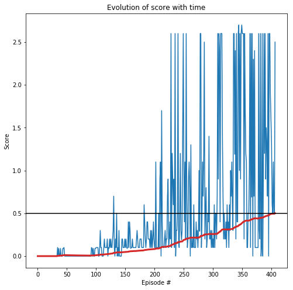

# Collaboration and Competition

---

You are welcome to use this coding environment to train your agent for the project.  Follow the instructions below to get started!

### 1. Start the Environment

Run the next code cell to install a few packages.  This line will take a few minutes to run!


```python
!pip -q install ./python
```

    tensorflow 1.7.1 has requirement numpy>=1.13.3, but you'll have numpy 1.12.1 which is incompatible.
    ipython 6.5.0 has requirement prompt-toolkit<2.0.0,>=1.0.15, but you'll have prompt-toolkit 3.0.5 which is incompatible.


The environment is already saved in the Workspace and can be accessed at the file path provided below. 


```python
from unityagents import UnityEnvironment
import numpy as np

env = UnityEnvironment(file_name="/data/Tennis_Linux_NoVis/Tennis")
```

    INFO:unityagents:
    'Academy' started successfully!
    Unity Academy name: Academy
            Number of Brains: 1
            Number of External Brains : 1
            Lesson number : 0
            Reset Parameters :
    		
    Unity brain name: TennisBrain
            Number of Visual Observations (per agent): 0
            Vector Observation space type: continuous
            Vector Observation space size (per agent): 8
            Number of stacked Vector Observation: 3
            Vector Action space type: continuous
            Vector Action space size (per agent): 2
            Vector Action descriptions: , 


Environments contain **_brains_** which are responsible for deciding the actions of their associated agents. Here we check for the first brain available, and set it as the default brain we will be controlling from Python.


```python
# get the default brain
brain_name = env.brain_names[0]
brain = env.brains[brain_name]
```

### 2. Examine the State and Action Spaces

Run the code cell below to print some information about the environment.


```python
# reset the environment
env_info = env.reset(train_mode=True)[brain_name]

# number of agents 
num_agents = len(env_info.agents)
print('Number of agents:', num_agents)

# size of each action
action_size = brain.vector_action_space_size
print('Size of each action:', action_size)

# examine the state space 
states = env_info.vector_observations
state_size = states.shape[1]
print('There are {} agents. Each observes a state with length: {}'.format(states.shape[0], state_size))
print('The state for the first agent looks like:', states[0])
print('The state for the second agent looks like:', states[1])
```

    Number of agents: 2
    Size of each action: 2
    There are 2 agents. Each observes a state with length: 24
    The state for the first agent looks like: [ 0.          0.          0.          0.          0.          0.          0.
      0.          0.          0.          0.          0.          0.          0.
      0.          0.         -6.65278625 -1.5        -0.          0.
      6.83172083  6.         -0.          0.        ]
    The state for the second agent looks like: [ 0.          0.          0.          0.          0.          0.          0.
      0.          0.          0.          0.          0.          0.          0.
      0.          0.         -6.4669857  -1.5         0.          0.
     -6.83172083  6.          0.          0.        ]


### 3. Take Random Actions in the Environment

In the next code cell, you will learn how to use the Python API to control the agent and receive feedback from the environment.

Note that **in this coding environment, you will not be able to watch the agents while they are training**, and you should set `train_mode=True` to restart the environment.


```python
#for i in range(5):                                         # play game for 5 episodes
#    env_info = env.reset(train_mode=False)[brain_name]     # reset the environment    
#    states = env_info.vector_observations                  # get the current state (for each agent)
#    scores = np.zeros(num_agents)                          # initialize the score (for each agent)
#    while True:
#        actions = np.random.randn(num_agents, action_size) # select an action (for each agent)
#        actions = np.clip(actions, -1, 1)                  # all actions between -1 and 1
#        env_info = env.step(actions)[brain_name]           # send all actions to tne environment
#        next_states = env_info.vector_observations         # get next state (for each agent)
#        rewards = env_info.rewards                         # get reward (for each agent)
#        dones = env_info.local_done                        # see if episode finished
#        scores += env_info.rewards                         # update the score (for each agent)
#        states = next_states                               # roll over states to next time step
#        if np.any(dones):                                  # exit loop if episode finished
#            break
#    print('Total score (averaged over agents) this episode: {}'.format(np.mean(scores)))
```

When finished, you can close the environment.


```python
#env.close()
```

### 4. It's Your Turn!

Now it's your turn to train your own agent to solve the environment!  A few **important notes**:
- When training the environment, set `train_mode=True`, so that the line for resetting the environment looks like the following:
```python
env_info = env.reset(train_mode=True)[brain_name]
```
- To structure your work, you're welcome to work directly in this Jupyter notebook, or you might like to start over with a new file!  You can see the list of files in the workspace by clicking on **_Jupyter_** in the top left corner of the notebook.
- In this coding environment, you will not be able to watch the agents while they are training.  However, **_after training the agents_**, you can download the saved model weights to watch the agents on your own machine! 

# Collaboration and Competition - Student's project work

The following sections show my code and results from my work on this project.
In general, my code is very similar to my solution of the second project, the Reacher environment with 20 agents.


I have implemented an Actor-Critic network with a DDPG algorithm:

Implementation follows the standard actor network implementation as described in the Udacity course videos regarding the DDPG algorithms. i.e. the bipedal walker or the pendulum exercises.

 - Actor neural network with three fully connected layers with sizes of: 24 (states) -> 256 (hidden) -> 128 (hidden) -> 2 (action value)
 - Critic neural network with three fully connected layers with sizes of: 24 (states) -> 256 (hidden) + 2 (action values) -> 128 (hidden) -> 1 (Q-value)

Both neural network architectures implement:

 - Linear fully connected layers: https://pytorch.org/docs/master/generated/torch.nn.Linear.html
 - Leaky rectangular linear unit activation function: https://pytorch.org/docs/stable/nn.html
 - Dropout between fully connected layersfor regularization: https://pytorch.org/docs/master/generated/torch.nn.Dropout.html
 - Batch Normalization on input to regularize input data: https://pytorch.org/docs/master/generated/torch.nn.BatchNorm1d.html

I have implemented an agent with:

 - Standard Deep Deterministic Policy Gradient Algorithm
 - Standard experience replay with random sampling
 - Standard Ornstein-Uhlenbeck process for noise on action value
 - Reduction of noise level depending on progress of simulation
 - Standard Mean-squared-error loss functions
 - Adam optimizer: https://pytorch.org/docs/stable/_modules/torch/optim/adam.html#Adam
 - Several learning passes per step of agent to improve learning and convergence

Note that these implementations give room for many more advanced changes, which of some will be discussed in the Final conclusions section.

I evolve the until the mean score of the last 100 episodes reachses a value of greater than 0.5. Then the training process is stopped and the result are outputted.


### Import all necessary packages at once


```python
# Import packages for the data processing before and after simulations
import time
import pickle
import math
import datetime
import random
import sys
import copy
import numpy as np
from collections import namedtuple, deque
import matplotlib.pyplot as plt
%matplotlib inline

# Import from PyTorch for neural network implementation
import torch
import torch.nn as nn
import torch.nn.functional as F
import torch.optim as optim

# Import to keep instance active while training on GPU
import workspace_utils
from workspace_utils import active_session
```

### Setting of variables for the neural network, training algorithms and unity environments


```python
BUFFER_SIZE = int(1e6)     # replay buffer size
BATCH_SIZE = 256           # minibatch size
GAMMA = 0.99               # discount factor
TAU = 0.001                # for soft update of target parameters
LR_ACTOR = 0.0001          # learning rate for actor network
LR_CRITIC = 0.001          # learning rate for critic network

FC_SIZE = 32               # number of neurons in layer of neural network
P_DROPOUT = 0.0            # dropout probability for neurons and network regularization

ACTION_SIZE = brain.vector_action_space_size # number of actions
STATE_SIZE = states.shape[1]    # number of states
N_AGENTS = len(env_info.agents) # number of agents

N_EPISODES = 5000          # number of maximum episodes for training

ENV_SOLVED = 0.5           # average score of agent to consider environment solved
RANDOM_SEED = 3            # seed integer for random number generator

NUM_PASSES = 8             # Number of learning passes per step

NOISE_COEFF = 0.5          # Weighting coefficient for noise process
```

### Check if training on GPU is possible, else use CPU


```python
# If GPU is available use for training otherwise use CPU
device = torch.device("cuda:0" if torch.cuda.is_available() else "cpu")

if device == "cpu":
    print("Available: CPU only")
else:
    print("Available: GPU cuda")
```

    Available: GPU cuda


### Implementation of noise process added to actions of agent

Implementation follows the standard noise Ornstein-Uhlenbeck process as described in the Udacity course videos regarding the DDPG algorithms. i.e. the bipedal walker or the pendulum exercises.


```python
# Ornstein-Uhlenbeck stochastic noise process
class OUNoise:

    def __init__(self):

        self.theta = 0.15
        self.sigma = 0.1
        self.size = (N_AGENTS, ACTION_SIZE)
        self.mu = np.zeros(self.size) # mu = 0.0
        self.reset()

    # Reset internal state to mean
    def reset(self):

        self.state = copy.copy(self.mu)

    # Update internal state and generate noise sample
    def sample(self):

        x = self.state
        dx = self.theta * (self.mu - x) + self.sigma * np.array([random.random() for _ in range(len(x))])
        self.state = x + dx
        
        return self.state
```

### Implementation of experience replay buffer

Implementation follows the standard replay buffer implementation as described in the Udacity course videos regarding the DDPG algorithms. i.e. the bipedal walker or the pendulum exercises.


```python
class ReplayBuffer:

    def __init__(self):

        self.memory = deque(maxlen = BUFFER_SIZE)
        self.experience = namedtuple("Experience", field_names=["state", "action", "reward", "next_state", "done"])
        self.seed = random.seed(RANDOM_SEED)
    
    # Add an experience to the memory
    def add(self, state, action, reward, next_state, done):

        e = self.experience(state, action, reward, next_state, done)
        self.memory.append(e)
    
    # Randomly sample experiences from the memory
    def sample(self):

        # Randomly draw a sample of size BATCH_SIZE
        experiences = random.sample(self.memory, k=BATCH_SIZE)

        states = torch.from_numpy(np.vstack([e.state for e in experiences if e is not None])).float().to(device)
        actions = torch.from_numpy(np.vstack([e.action for e in experiences if e is not None])).float().to(device)
        rewards = torch.from_numpy(np.vstack([e.reward for e in experiences if e is not None])).float().to(device)
        next_states = torch.from_numpy(np.vstack([e.next_state for e in experiences if e is not None])).float().to(device)
        dones = torch.from_numpy(np.vstack([e.done for e in experiences if e is not None]).astype(np.uint8)).float().to(device)

        return (states, actions, rewards, next_states, dones)

    # Calculate length of memory
    def __len__(self):

        return len(self.memory)
```

### Initialization of weights in hidden layer

Implementation follows the standard weight implementation as described in the Udacity course videos regarding the DDPG algorithms. i.e. the bipedal walker or the pendulum exercises.


```python
def hidden_init(layer):
    
    fan_in = layer.weight.data.size()[0]
    lim = 1.0 / np.sqrt(fan_in)
    
    return (-lim, lim)
```

### Actor network for Actor-Critic-setup

Implementation follows the standard actor network implementation as described in the Udacity course videos regarding the DDPG algorithms. i.e. the bipedal walker or the pendulum exercises.

Standard neural network with three fully connected layers with sizes of: 24 (states) -> 256 (hidden) -> 128 (hidden) -> 2 (action value)

 - Linear fully connected layers: https://pytorch.org/docs/master/generated/torch.nn.Linear.html
 - Leaky rectangular linear unit activation function: https://pytorch.org/docs/stable/nn.html
 - Dropout between fully connected layersfor regularization: https://pytorch.org/docs/master/generated/torch.nn.Dropout.html
 - Batch Normalization on input to regularize input data: https://pytorch.org/docs/master/generated/torch.nn.BatchNorm1d.html


```python
class Actor(nn.Module):

    def __init__(self):

        super(Actor, self).__init__()
        
        self.seed = torch.manual_seed(RANDOM_SEED)
        
        self.fc1 = nn.Linear(STATE_SIZE, 8*FC_SIZE)
        self.fc2 = nn.Linear(8*FC_SIZE, 4*FC_SIZE)
        self.fc3 = nn.Linear(4*FC_SIZE, ACTION_SIZE)
        
        self.dropout = nn.Dropout(P_DROPOUT)
        self.bn = nn.BatchNorm1d(STATE_SIZE)
        
        self.reset_parameters()

    def reset_parameters(self):
        
        self.fc1.weight.data.uniform_(*hidden_init(self.fc1))
        self.fc2.weight.data.uniform_(*hidden_init(self.fc2))
        self.fc3.weight.data.uniform_(-3e-3, 3e-3)
        #self.fc1.bias.data.fill_(np.random.uniform())
        #self.fc2.bias.data.fill_(np.random.uniform())
        #self.fc3.bias.data.fill_(np.random.uniform())

    def forward(self, state):

        x = self.bn(state)
            
        x = F.leaky_relu(self.fc1(x))
        
        x = F.leaky_relu(self.fc2(x))
        x = self.dropout(x) # dropout regularization
        
        result = torch.tanh(self.fc3(x)) # tanh to yield continous value between -1.0 and 1.0
        return result
```

### Critic network for Actor-Critic-setup

Implementation follows the standard critic network implementation as described in the Udacity course videos regarding the DDPG algorithms. i.e. the bipedal walker or the pendulum exercises.

Standard neural network with three fully connected layers with sizes of: 24 (states) -> 256 (hidden) + 2 (action values) -> 128 (hidden) -> 1 (Q-value)

 - Linear fully connected layers: https://pytorch.org/docs/master/generated/torch.nn.Linear.html
 - Leaky rectangular linear unit activation function: https://pytorch.org/docs/stable/nn.html
 - Dropout between fully connected layersfor regularization: https://pytorch.org/docs/master/generated/torch.nn.Dropout.html
 - Batch Normalization on input to regularize input data: https://pytorch.org/docs/master/generated/torch.nn.BatchNorm1d.html

Note, that at the first hidden layer, the action values are added into the network.


```python
class Critic(nn.Module):

    def __init__(self):

        super(Critic, self).__init__()
        
        self.seed = torch.manual_seed(RANDOM_SEED)
        
        self.fc1 = nn.Linear(STATE_SIZE, 8*FC_SIZE)
        self.fc2 = nn.Linear(8*FC_SIZE + ACTION_SIZE, 4*FC_SIZE)
        self.fc3 = nn.Linear(4*FC_SIZE, 1)
        
        self.dropout = nn.Dropout(P_DROPOUT)
        self.bn = nn.BatchNorm1d(STATE_SIZE)

        self.reset_parameters()

    def reset_parameters(self):
        
        self.fc1.weight.data.uniform_(*hidden_init(self.fc1))
        self.fc2.weight.data.uniform_(*hidden_init(self.fc2))
        self.fc3.weight.data.uniform_(-3e-3, 3e-3)
        #self.fc1.bias.data.fill_(np.random.uniform())
        #self.fc2.bias.data.fill_(np.random.uniform())
        #self.fc3.bias.data.fill_(np.random.uniform())

    def forward(self, state, action):
        
        x = self.bn(state)
        
        x = F.leaky_relu(self.fc1(x))

        x = torch.cat((x, action), dim=1) # merge action vector into network

        x = F.leaky_relu(self.fc2(x))
        x = self.dropout(x) # dropout regularization
        
        result = self.fc3(x) # no activation as we need a real Q value
        return result
```

### Implementation of agent

Implementation of agent follows the standard implementation of DDPF as described in the Udacity course videos regarding the Bipedal Walker or the Pendulum and given in their corresponding Jupyter Notebooks.

Standard implementation using:

 - Standard Actor Critic network with three fully connected layers, leaky rectangular linear unig and dropout regularization
 - Standard Deep Deterministic Policy Gradient Algorithm
 - Standard experience replay with random sampling
 - Standard Ornstein-Uhlenbeck process for noise on action value
 - Reduction of noise level with progress of simulation
 - Standard Mean-squared-error loss functions
 - Adam optimizer: https://pytorch.org/docs/stable/_modules/torch/optim/adam.html#Adam
 - Multiple learning passes (drawn from buffer) on every step


```python
class Agent():
    
    def __init__(self):

        self.seed = random.seed(RANDOM_SEED)

        # Actor Network (w/ Target Network)
        self.actor_local = Actor().to(device)
        self.actor_target = Actor().to(device)
        self.actor_optimizer = optim.Adam(self.actor_local.parameters(), lr=LR_ACTOR)

        # Critic Network (w/ Target Network)
        self.critic_local = Critic().to(device)
        self.critic_target = Critic().to(device)
        self.critic_optimizer = optim.Adam(self.critic_local.parameters(), lr=LR_CRITIC)

        # Replay memory
        self.memory = ReplayBuffer()
        
        # Noise process
        self.noise = OUNoise()
        
    # Perform step
    def step(self, state, action, reward, next_state, done):

        self.memory.add(state, action, reward, next_state, done)
            
        # Learn, if enough samples are available in memory
        if len(self.memory) > BATCH_SIZE:
            for _ in range(NUM_PASSES):
                experiences = self.memory.sample()
                self.learn(experiences)

    # Reset noise
    def reset(self):
        self.noise.reset()
                
    # Choose action for agent according to given policy
    def act(self, state, noco = NOISE_COEFF):

        state = torch.from_numpy(state).float().to(device)
        self.actor_local.eval()
        
        with torch.no_grad():
            action = self.actor_local(state).cpu().data.numpy()
        
        action += noco * self.noise.sample()
        
        self.actor_local.train()
        
        return np.clip(action, -1, 1)

    # Learn from experiences
    def learn(self, experiences):

        states, actions, rewards, next_states, dones = experiences

        # Get next actions from actor and corresponding Q from critic
        actions_next = self.actor_target(next_states)
        Q_targets_next = self.critic_target(next_states, actions_next)
        
        # Calculate target Q
        Q_targets = rewards + (GAMMA * Q_targets_next * (1.0 - dones))
        
        # Get expected Q
        Q_expected = self.critic_local(states, actions)
        
        # Standard mean-sqaured-error loss function
        critic_loss = F.mse_loss(Q_expected, Q_targets)
        
        # Reset the gradients
        self.critic_optimizer.zero_grad()
        # Perform backpropagation
        critic_loss.backward()
        # Optimize weights
        self.critic_optimizer.step()

        
        # Compute loss function for actor
        actions_pred = self.actor_local(states)
        actor_loss = -self.critic_local(states, actions_pred).mean()

        # Reset the gradients
        self.actor_optimizer.zero_grad()
        # Perform backpropagation
        actor_loss.backward()
        # Optimize weights
        self.actor_optimizer.step()

        # Update networks
        self.soft_update(self.critic_local, self.critic_target)
        self.soft_update(self.actor_local, self.actor_target)
        
    def soft_update(self, local_model, target_model):

        for target_param, local_param in zip(target_model.parameters(), local_model.parameters()):
            target_param.data.copy_(TAU * local_param.data + (1.0 - TAU) * target_param.data)
```

### Training of agent with deep deterministic policy gradient

Algorithm loops over a number of eposiodes with maximum of N_EPISODES=2500, each for a time until the ball has dropped onto the ground:

 - It is possible to output the weights every 50 episodes
 - Every 10 episodes the weights are temporary written into a file
 - The environment is considered solved if the average score (of all agents) is greater than ENV_SOLVED=0.50 for the last 100 episodes.
 - If the environment is solved, the training is stopped and the final weights are written in a file
 - Noise level decays exponentially with time


```python
def ddpg():
    
    scores_window = deque(maxlen = 100)
    scores_max = []
    
    for i_episode in range(1, N_EPISODES + 1):
        
        env_info = env.reset(train_mode=True)[brain_name]      # reset the environment    
        states = env_info.vector_observations                  # get current state
        scores = np.zeros(N_AGENTS)                            # reset scores
        agent.reset()
        
        noco = NOISE_COEFF * (0.996 ** np.float(i_episode))
        
        while True:
   
            actions = agent.act(states, noco)                  # select an action (for each agent)
            
            env_info = env.step(actions)[brain_name]           # send the action to the environment
            
            next_states = env_info.vector_observations         # get next state (for each agent)
            rewards = env_info.rewards                         # get reward (for each agent)
            dones = env_info.local_done                        # see if episode finished (for each agent)
            
            for state, action, reward, next_state, done in zip(states, actions, rewards, next_states, dones):
                agent.step(state, action, reward, next_state, done)
            
            scores += rewards                                  # update the score (for each agent)
            states = next_states                               # roll over states to next time step
            
            if np.any(dones):                                  # exit loop if episode finished
                break

        scores_max.append(np.max(scores))                      # episode reward as maximum score of both agents
        scores_window.append(scores_max)                       # save most recent score

        if i_episode % 1 == 0:
            print('\rEpisode {}\tCurrent Score: {:.4f}\tAverage Score: {:.4f}\tNoise: {:.4f}'.format(i_episode, np.max(scores), np.mean(scores_window), noco))
        
        if i_episode % 10 == 0:
            torch.save(agent.actor_local.state_dict(), 'checkpoint_actor_temp.pth')
            torch.save(agent.critic_local.state_dict(), 'checkpoint_critic_temp.pth')
            
            f = open('scores_temp.pckl', 'wb')
            
            # Old version containing bug
            #pickle.dump(scores, f)
            
            # Fixed version
            pickle.dump(scores_max, f)
            
            f.close()

        # Output temporary weights file every 50 episodes.
        #if i_episode % 50 == 0:
        #    print('\rEpisode {}\tAverage Score: {:.2f}'.format(i_episode, np.mean(scores_window)))
        #    torch.save(agent.actor_local.state_dict(), 'checkpoint_actor_temp.pth')
        #    torch.save(agent.critic_local.state_dict(), 'checkpoint_critic_temp.pth')
        
        # Output final weights after environment is solved
        if np.mean(scores_window) > ENV_SOLVED:
            print('\nEnvironment solved in {:d} episodes!\tAverage Score: {:.4f}'.format(i_episode, np.mean(scores_window)))
            torch.save(agent.actor_local.state_dict(), 'checkpoint_actor.pth')
            torch.save(agent.critic_local.state_dict(), 'checkpoint_critic.pth')
            break

    # Old version containing bug
    #return scores

    # Fixed version
    return scores_max

```


```python
if device == "cpu":
    print("Running on CPU.")
else:
    print("Running on GPU.")
```

    Running on GPU.


### Main Loop

In the following cell all the previous implementations come into play. The agent architecture is subsequently trained and the weights of the final solution as well as the time evolution of average reward are stored into files.


```python
print("\nTraining Loop:\n")

agent = Agent()

with active_session():
    scores = ddpg()

f = open('scores.pckl', 'wb')
pickle.dump(scores, f)
f.close()
```

    
    Training Loop:
    
    Episode 1	Current Score: 0.0000	Average Score: 0.0000	Noise: 0.4980
    Episode 2	Current Score: 0.0000	Average Score: 0.0000	Noise: 0.4960
    Episode 3	Current Score: 0.0000	Average Score: 0.0000	Noise: 0.4940
    Episode 4	Current Score: 0.0000	Average Score: 0.0000	Noise: 0.4920
    Episode 5	Current Score: 0.0000	Average Score: 0.0000	Noise: 0.4901
    Episode 6	Current Score: 0.0000	Average Score: 0.0000	Noise: 0.4881
    Episode 7	Current Score: 0.0000	Average Score: 0.0000	Noise: 0.4862
    Episode 8	Current Score: 0.0000	Average Score: 0.0000	Noise: 0.4842
    Episode 9	Current Score: 0.0000	Average Score: 0.0000	Noise: 0.4823
    Episode 10	Current Score: 0.0000	Average Score: 0.0000	Noise: 0.4804
    Episode 11	Current Score: 0.0000	Average Score: 0.0000	Noise: 0.4784
    Episode 12	Current Score: 0.0000	Average Score: 0.0000	Noise: 0.4765
    Episode 13	Current Score: 0.0000	Average Score: 0.0000	Noise: 0.4746
    Episode 14	Current Score: 0.0000	Average Score: 0.0000	Noise: 0.4727
    Episode 15	Current Score: 0.0000	Average Score: 0.0000	Noise: 0.4708
    Episode 16	Current Score: 0.0000	Average Score: 0.0000	Noise: 0.4689
    Episode 17	Current Score: 0.0000	Average Score: 0.0000	Noise: 0.4671
    Episode 18	Current Score: 0.0000	Average Score: 0.0000	Noise: 0.4652
    Episode 19	Current Score: 0.0000	Average Score: 0.0000	Noise: 0.4633
    Episode 20	Current Score: 0.0000	Average Score: 0.0000	Noise: 0.4615
    Episode 21	Current Score: 0.0000	Average Score: 0.0000	Noise: 0.4596
    Episode 22	Current Score: 0.0000	Average Score: 0.0000	Noise: 0.4578
    Episode 23	Current Score: 0.0000	Average Score: 0.0000	Noise: 0.4560
    Episode 24	Current Score: 0.0000	Average Score: 0.0000	Noise: 0.4541
    Episode 25	Current Score: 0.0000	Average Score: 0.0000	Noise: 0.4523
    Episode 26	Current Score: 0.0000	Average Score: 0.0000	Noise: 0.4505
    Episode 27	Current Score: 0.0000	Average Score: 0.0000	Noise: 0.4487
    Episode 28	Current Score: 0.0000	Average Score: 0.0000	Noise: 0.4469
    Episode 29	Current Score: 0.0000	Average Score: 0.0000	Noise: 0.4451
    Episode 30	Current Score: 0.0000	Average Score: 0.0000	Noise: 0.4434
    Episode 31	Current Score: 0.0000	Average Score: 0.0000	Noise: 0.4416
    Episode 32	Current Score: 0.0000	Average Score: 0.0000	Noise: 0.4398
    Episode 33	Current Score: 0.0000	Average Score: 0.0000	Noise: 0.4381
    Episode 34	Current Score: 0.0000	Average Score: 0.0000	Noise: 0.4363
    Episode 35	Current Score: 0.1000	Average Score: 0.0029	Noise: 0.4346
    Episode 36	Current Score: 0.0000	Average Score: 0.0028	Noise: 0.4328
    Episode 37	Current Score: 0.0900	Average Score: 0.0051	Noise: 0.4311
    Episode 38	Current Score: 0.0000	Average Score: 0.0050	Noise: 0.4294
    Episode 39	Current Score: 0.0000	Average Score: 0.0049	Noise: 0.4276
    Episode 40	Current Score: 0.0900	Average Score: 0.0070	Noise: 0.4259
    Episode 41	Current Score: 0.0000	Average Score: 0.0068	Noise: 0.4242
    Episode 42	Current Score: 0.0000	Average Score: 0.0067	Noise: 0.4225
    Episode 43	Current Score: 0.0000	Average Score: 0.0065	Noise: 0.4208
    Episode 44	Current Score: 0.0900	Average Score: 0.0084	Noise: 0.4192
    Episode 45	Current Score: 0.0900	Average Score: 0.0102	Noise: 0.4175
    Episode 46	Current Score: 0.1000	Average Score: 0.0122	Noise: 0.4158
    Episode 47	Current Score: 0.0000	Average Score: 0.0119	Noise: 0.4142
    Episode 48	Current Score: 0.0000	Average Score: 0.0117	Noise: 0.4125
    Episode 49	Current Score: 0.0000	Average Score: 0.0114	Noise: 0.4108
    Episode 50	Current Score: 0.0000	Average Score: 0.0112	Noise: 0.4092
    Episode 51	Current Score: 0.0000	Average Score: 0.0110	Noise: 0.4076
    Episode 52	Current Score: 0.0000	Average Score: 0.0108	Noise: 0.4059
    Episode 53	Current Score: 0.0000	Average Score: 0.0106	Noise: 0.4043
    Episode 54	Current Score: 0.0000	Average Score: 0.0104	Noise: 0.4027
    Episode 55	Current Score: 0.0000	Average Score: 0.0102	Noise: 0.4011
    Episode 56	Current Score: 0.0000	Average Score: 0.0100	Noise: 0.3995
    Episode 57	Current Score: 0.0000	Average Score: 0.0098	Noise: 0.3979
    Episode 58	Current Score: 0.0000	Average Score: 0.0097	Noise: 0.3963
    Episode 59	Current Score: 0.0000	Average Score: 0.0095	Noise: 0.3947
    Episode 60	Current Score: 0.0000	Average Score: 0.0093	Noise: 0.3931
    Episode 61	Current Score: 0.0000	Average Score: 0.0092	Noise: 0.3916
    Episode 62	Current Score: 0.0000	Average Score: 0.0090	Noise: 0.3900
    Episode 63	Current Score: 0.0000	Average Score: 0.0089	Noise: 0.3884
    Episode 64	Current Score: 0.0000	Average Score: 0.0088	Noise: 0.3869
    Episode 65	Current Score: 0.0000	Average Score: 0.0086	Noise: 0.3853
    Episode 66	Current Score: 0.0000	Average Score: 0.0085	Noise: 0.3838
    Episode 67	Current Score: 0.0000	Average Score: 0.0084	Noise: 0.3822
    Episode 68	Current Score: 0.0000	Average Score: 0.0082	Noise: 0.3807
    Episode 69	Current Score: 0.0000	Average Score: 0.0081	Noise: 0.3792
    Episode 70	Current Score: 0.0000	Average Score: 0.0080	Noise: 0.3777
    Episode 71	Current Score: 0.0000	Average Score: 0.0079	Noise: 0.3762
    Episode 72	Current Score: 0.0000	Average Score: 0.0078	Noise: 0.3747
    Episode 73	Current Score: 0.0000	Average Score: 0.0077	Noise: 0.3732
    Episode 74	Current Score: 0.0000	Average Score: 0.0076	Noise: 0.3717
    Episode 75	Current Score: 0.0000	Average Score: 0.0075	Noise: 0.3702
    Episode 76	Current Score: 0.0000	Average Score: 0.0074	Noise: 0.3687
    Episode 77	Current Score: 0.0000	Average Score: 0.0073	Noise: 0.3672
    Episode 78	Current Score: 0.0000	Average Score: 0.0072	Noise: 0.3658
    Episode 79	Current Score: 0.0000	Average Score: 0.0071	Noise: 0.3643
    Episode 80	Current Score: 0.0000	Average Score: 0.0070	Noise: 0.3628
    Episode 81	Current Score: 0.0000	Average Score: 0.0069	Noise: 0.3614
    Episode 82	Current Score: 0.0000	Average Score: 0.0068	Noise: 0.3599
    Episode 83	Current Score: 0.0000	Average Score: 0.0067	Noise: 0.3585
    Episode 84	Current Score: 0.0000	Average Score: 0.0067	Noise: 0.3571
    Episode 85	Current Score: 0.0000	Average Score: 0.0066	Noise: 0.3556
    Episode 86	Current Score: 0.0000	Average Score: 0.0065	Noise: 0.3542
    Episode 87	Current Score: 0.0000	Average Score: 0.0064	Noise: 0.3528
    Episode 88	Current Score: 0.0000	Average Score: 0.0064	Noise: 0.3514
    Episode 89	Current Score: 0.0000	Average Score: 0.0063	Noise: 0.3500
    Episode 90	Current Score: 0.0000	Average Score: 0.0062	Noise: 0.3486
    Episode 91	Current Score: 0.0000	Average Score: 0.0062	Noise: 0.3472
    Episode 92	Current Score: 0.0000	Average Score: 0.0061	Noise: 0.3458
    Episode 93	Current Score: 0.1000	Average Score: 0.0071	Noise: 0.3444
    Episode 94	Current Score: 0.0900	Average Score: 0.0080	Noise: 0.3430
    Episode 95	Current Score: 0.0000	Average Score: 0.0079	Noise: 0.3417
    Episode 96	Current Score: 0.0900	Average Score: 0.0088	Noise: 0.3403
    Episode 97	Current Score: 0.0000	Average Score: 0.0087	Noise: 0.3389
    Episode 98	Current Score: 0.0000	Average Score: 0.0086	Noise: 0.3376
    Episode 99	Current Score: 0.0900	Average Score: 0.0094	Noise: 0.3362
    Episode 100	Current Score: 0.0900	Average Score: 0.0102	Noise: 0.3349
    Episode 101	Current Score: 0.1000	Average Score: 0.0111	Noise: 0.3336
    Episode 102	Current Score: 0.1000	Average Score: 0.0120	Noise: 0.3322
    Episode 103	Current Score: 0.1000	Average Score: 0.0128	Noise: 0.3309
    Episode 104	Current Score: 0.1000	Average Score: 0.0137	Noise: 0.3296
    Episode 105	Current Score: 0.0000	Average Score: 0.0135	Noise: 0.3282
    Episode 106	Current Score: 0.0000	Average Score: 0.0134	Noise: 0.3269
    Episode 107	Current Score: 0.1000	Average Score: 0.0142	Noise: 0.3256
    Episode 108	Current Score: 0.3000	Average Score: 0.0169	Noise: 0.3243
    Episode 109	Current Score: 0.1000	Average Score: 0.0176	Noise: 0.3230
    Episode 110	Current Score: 0.1000	Average Score: 0.0184	Noise: 0.3217
    Episode 111	Current Score: 0.0000	Average Score: 0.0182	Noise: 0.3204
    Episode 112	Current Score: 0.0000	Average Score: 0.0180	Noise: 0.3192
    Episode 113	Current Score: 0.0000	Average Score: 0.0179	Noise: 0.3179
    Episode 114	Current Score: 0.0900	Average Score: 0.0185	Noise: 0.3166
    Episode 115	Current Score: 0.2000	Average Score: 0.0201	Noise: 0.3154
    Episode 116	Current Score: 0.1000	Average Score: 0.0208	Noise: 0.3141
    Episode 117	Current Score: 0.1000	Average Score: 0.0215	Noise: 0.3128
    Episode 118	Current Score: 0.1000	Average Score: 0.0221	Noise: 0.3116
    Episode 119	Current Score: 0.1000	Average Score: 0.0228	Noise: 0.3103
    Episode 120	Current Score: 0.2000	Average Score: 0.0243	Noise: 0.3091
    Episode 121	Current Score: 0.0000	Average Score: 0.0240	Noise: 0.3079
    Episode 122	Current Score: 0.1000	Average Score: 0.0247	Noise: 0.3066
    Episode 123	Current Score: 0.0900	Average Score: 0.0252	Noise: 0.3054
    Episode 124	Current Score: 0.2000	Average Score: 0.0266	Noise: 0.3042
    Episode 125	Current Score: 0.1000	Average Score: 0.0272	Noise: 0.3030
    Episode 126	Current Score: 0.2000	Average Score: 0.0286	Noise: 0.3017
    Episode 127	Current Score: 0.1000	Average Score: 0.0291	Noise: 0.3005
    Episode 128	Current Score: 0.1000	Average Score: 0.0297	Noise: 0.2993
    Episode 129	Current Score: 0.2000	Average Score: 0.0310	Noise: 0.2981
    Episode 130	Current Score: 0.2900	Average Score: 0.0330	Noise: 0.2970
    Episode 131	Current Score: 0.7000	Average Score: 0.0381	Noise: 0.2958
    Episode 132	Current Score: 0.1000	Average Score: 0.0386	Noise: 0.2946
    Episode 133	Current Score: 0.0000	Average Score: 0.0383	Noise: 0.2934
    Episode 134	Current Score: 0.2000	Average Score: 0.0395	Noise: 0.2922
    Episode 135	Current Score: 0.1000	Average Score: 0.0399	Noise: 0.2911
    Episode 136	Current Score: 0.5000	Average Score: 0.0433	Noise: 0.2899
    Episode 137	Current Score: 0.0000	Average Score: 0.0430	Noise: 0.2887
    Episode 138	Current Score: 0.1000	Average Score: 0.0434	Noise: 0.2876
    Episode 139	Current Score: 0.0000	Average Score: 0.0431	Noise: 0.2864
    Episode 140	Current Score: 0.3000	Average Score: 0.0449	Noise: 0.2853
    Episode 141	Current Score: 0.0000	Average Score: 0.0446	Noise: 0.2841
    Episode 142	Current Score: 0.0000	Average Score: 0.0443	Noise: 0.2830
    Episode 143	Current Score: 0.0000	Average Score: 0.0440	Noise: 0.2819
    Episode 144	Current Score: 0.0000	Average Score: 0.0437	Noise: 0.2807
    Episode 145	Current Score: 0.2000	Average Score: 0.0448	Noise: 0.2796
    Episode 146	Current Score: 0.2000	Average Score: 0.0458	Noise: 0.2785
    Episode 147	Current Score: 0.1000	Average Score: 0.0462	Noise: 0.2774
    Episode 148	Current Score: 0.1000	Average Score: 0.0466	Noise: 0.2763
    Episode 149	Current Score: 0.1000	Average Score: 0.0469	Noise: 0.2752
    Episode 150	Current Score: 0.2000	Average Score: 0.0479	Noise: 0.2741
    Episode 151	Current Score: 0.1000	Average Score: 0.0483	Noise: 0.2730
    Episode 152	Current Score: 0.2000	Average Score: 0.0493	Noise: 0.2719
    Episode 153	Current Score: 0.1000	Average Score: 0.0496	Noise: 0.2708
    Episode 154	Current Score: 0.0900	Average Score: 0.0499	Noise: 0.2697
    Episode 155	Current Score: 0.1000	Average Score: 0.0502	Noise: 0.2686
    Episode 156	Current Score: 0.4000	Average Score: 0.0524	Noise: 0.2676
    Episode 157	Current Score: 0.1000	Average Score: 0.0527	Noise: 0.2665
    Episode 158	Current Score: 0.4000	Average Score: 0.0549	Noise: 0.2654
    Episode 159	Current Score: 0.3000	Average Score: 0.0565	Noise: 0.2644
    Episode 160	Current Score: 0.0900	Average Score: 0.0567	Noise: 0.2633
    Episode 161	Current Score: 0.1000	Average Score: 0.0570	Noise: 0.2623
    Episode 162	Current Score: 0.1000	Average Score: 0.0572	Noise: 0.2612
    Episode 163	Current Score: 0.2000	Average Score: 0.0581	Noise: 0.2602
    Episode 164	Current Score: 0.1000	Average Score: 0.0584	Noise: 0.2591
    Episode 165	Current Score: 0.1000	Average Score: 0.0586	Noise: 0.2581
    Episode 166	Current Score: 0.1000	Average Score: 0.0589	Noise: 0.2571
    Episode 167	Current Score: 0.1000	Average Score: 0.0591	Noise: 0.2560
    Episode 168	Current Score: 0.1000	Average Score: 0.0593	Noise: 0.2550
    Episode 169	Current Score: 0.1000	Average Score: 0.0596	Noise: 0.2540
    Episode 170	Current Score: 0.2000	Average Score: 0.0604	Noise: 0.2530
    Episode 171	Current Score: 0.3000	Average Score: 0.0618	Noise: 0.2520
    Episode 172	Current Score: 0.1900	Average Score: 0.0626	Noise: 0.2509
    Episode 173	Current Score: 0.1000	Average Score: 0.0628	Noise: 0.2499
    Episode 174	Current Score: 0.1000	Average Score: 0.0630	Noise: 0.2489
    Episode 175	Current Score: 0.1000	Average Score: 0.0632	Noise: 0.2479
    Episode 176	Current Score: 0.2000	Average Score: 0.0640	Noise: 0.2470
    Episode 177	Current Score: 0.2000	Average Score: 0.0647	Noise: 0.2460
    Episode 178	Current Score: 0.2000	Average Score: 0.0655	Noise: 0.2450
    Episode 179	Current Score: 0.1000	Average Score: 0.0657	Noise: 0.2440
    Episode 180	Current Score: 0.1000	Average Score: 0.0659	Noise: 0.2430
    Episode 181	Current Score: 0.1000	Average Score: 0.0661	Noise: 0.2421
    Episode 182	Current Score: 0.1000	Average Score: 0.0663	Noise: 0.2411
    Episode 183	Current Score: 0.6000	Average Score: 0.0692	Noise: 0.2401
    Episode 184	Current Score: 0.4000	Average Score: 0.0710	Noise: 0.2392
    Episode 185	Current Score: 0.2000	Average Score: 0.0717	Noise: 0.2382
    Episode 186	Current Score: 0.1000	Average Score: 0.0718	Noise: 0.2373
    Episode 187	Current Score: 0.2000	Average Score: 0.0725	Noise: 0.2363
    Episode 188	Current Score: 0.4000	Average Score: 0.0743	Noise: 0.2354
    Episode 189	Current Score: 0.4000	Average Score: 0.0760	Noise: 0.2344
    Episode 190	Current Score: 0.2000	Average Score: 0.0766	Noise: 0.2335
    Episode 191	Current Score: 0.2000	Average Score: 0.0773	Noise: 0.2325
    Episode 192	Current Score: 0.2000	Average Score: 0.0779	Noise: 0.2316
    Episode 193	Current Score: 0.1000	Average Score: 0.0780	Noise: 0.2307
    Episode 194	Current Score: 0.3000	Average Score: 0.0792	Noise: 0.2298
    Episode 195	Current Score: 0.1000	Average Score: 0.0793	Noise: 0.2288
    Episode 196	Current Score: 0.3000	Average Score: 0.0804	Noise: 0.2279
    Episode 197	Current Score: 0.1000	Average Score: 0.0805	Noise: 0.2270
    Episode 198	Current Score: 0.2000	Average Score: 0.0811	Noise: 0.2261
    Episode 199	Current Score: 0.4000	Average Score: 0.0827	Noise: 0.2252
    Episode 200	Current Score: 0.2000	Average Score: 0.0833	Noise: 0.2243
    Episode 201	Current Score: 0.1000	Average Score: 0.0834	Noise: 0.2234
    Episode 202	Current Score: 0.1000	Average Score: 0.0835	Noise: 0.2225
    Episode 203	Current Score: 1.1000	Average Score: 0.0885	Noise: 0.2216
    Episode 204	Current Score: 0.1000	Average Score: 0.0885	Noise: 0.2207
    Episode 205	Current Score: 0.1000	Average Score: 0.0886	Noise: 0.2199
    Episode 206	Current Score: 0.1000	Average Score: 0.0886	Noise: 0.2190
    Episode 207	Current Score: 0.1000	Average Score: 0.0887	Noise: 0.2181
    Episode 208	Current Score: 0.5000	Average Score: 0.0907	Noise: 0.2172
    Episode 209	Current Score: 0.1000	Average Score: 0.0907	Noise: 0.2164
    Episode 210	Current Score: 0.9000	Average Score: 0.0946	Noise: 0.2155
    Episode 211	Current Score: 1.1000	Average Score: 0.0993	Noise: 0.2146
    Episode 212	Current Score: 0.0000	Average Score: 0.0989	Noise: 0.2138
    Episode 213	Current Score: 1.7000	Average Score: 0.1064	Noise: 0.2129
    Episode 214	Current Score: 0.4000	Average Score: 0.1078	Noise: 0.2121
    Episode 215	Current Score: 0.1000	Average Score: 0.1077	Noise: 0.2112
    Episode 216	Current Score: 0.1000	Average Score: 0.1077	Noise: 0.2104
    Episode 217	Current Score: 0.1000	Average Score: 0.1076	Noise: 0.2095
    Episode 218	Current Score: 0.2000	Average Score: 0.1081	Noise: 0.2087
    Episode 219	Current Score: 0.3000	Average Score: 0.1089	Noise: 0.2079
    Episode 220	Current Score: 0.1000	Average Score: 0.1089	Noise: 0.2070
    Episode 221	Current Score: 0.2000	Average Score: 0.1093	Noise: 0.2062
    Episode 222	Current Score: 0.2000	Average Score: 0.1097	Noise: 0.2054
    Episode 223	Current Score: 0.7000	Average Score: 0.1124	Noise: 0.2046
    Episode 224	Current Score: 0.9000	Average Score: 0.1159	Noise: 0.2037
    Episode 225	Current Score: 0.1000	Average Score: 0.1158	Noise: 0.2029
    Episode 226	Current Score: 0.2000	Average Score: 0.1162	Noise: 0.2021
    Episode 227	Current Score: 0.4000	Average Score: 0.1174	Noise: 0.2013
    Episode 228	Current Score: 0.2000	Average Score: 0.1178	Noise: 0.2005
    Episode 229	Current Score: 2.6000	Average Score: 0.1286	Noise: 0.1997
    Episode 230	Current Score: 0.1000	Average Score: 0.1285	Noise: 0.1989
    Episode 231	Current Score: 1.2000	Average Score: 0.1332	Noise: 0.1981
    Episode 232	Current Score: 0.9000	Average Score: 0.1365	Noise: 0.1973
    Episode 233	Current Score: 0.6000	Average Score: 0.1385	Noise: 0.1965
    Episode 234	Current Score: 0.9000	Average Score: 0.1417	Noise: 0.1957
    Episode 235	Current Score: 0.1000	Average Score: 0.1415	Noise: 0.1949
    Episode 236	Current Score: 2.6000	Average Score: 0.1519	Noise: 0.1942
    Episode 237	Current Score: 0.0000	Average Score: 0.1513	Noise: 0.1934
    Episode 238	Current Score: 0.3000	Average Score: 0.1519	Noise: 0.1926
    Episode 239	Current Score: 0.3000	Average Score: 0.1526	Noise: 0.1918
    Episode 240	Current Score: 0.5000	Average Score: 0.1540	Noise: 0.1911
    Episode 241	Current Score: 2.6000	Average Score: 0.1641	Noise: 0.1903
    Episode 242	Current Score: 0.2000	Average Score: 0.1643	Noise: 0.1896
    Episode 243	Current Score: 0.1000	Average Score: 0.1640	Noise: 0.1888
    Episode 244	Current Score: 0.5000	Average Score: 0.1654	Noise: 0.1880
    Episode 245	Current Score: 1.2000	Average Score: 0.1696	Noise: 0.1873
    Episode 246	Current Score: 0.3000	Average Score: 0.1702	Noise: 0.1865
    Episode 247	Current Score: 0.1900	Average Score: 0.1702	Noise: 0.1858
    Episode 248	Current Score: 0.3000	Average Score: 0.1708	Noise: 0.1850
    Episode 249	Current Score: 1.5000	Average Score: 0.1761	Noise: 0.1843
    Episode 250	Current Score: 2.6000	Average Score: 0.1858	Noise: 0.1836
    Episode 251	Current Score: 1.1000	Average Score: 0.1894	Noise: 0.1828
    Episode 252	Current Score: 0.4000	Average Score: 0.1903	Noise: 0.1821
    Episode 253	Current Score: 1.1000	Average Score: 0.1939	Noise: 0.1814
    Episode 254	Current Score: 0.2000	Average Score: 0.1939	Noise: 0.1807
    Episode 255	Current Score: 2.6000	Average Score: 0.2033	Noise: 0.1799
    Episode 256	Current Score: 0.7000	Average Score: 0.2053	Noise: 0.1792
    Episode 257	Current Score: 0.1000	Average Score: 0.2049	Noise: 0.1785
    Episode 258	Current Score: 0.2000	Average Score: 0.2048	Noise: 0.1778
    Episode 259	Current Score: 0.9000	Average Score: 0.2075	Noise: 0.1771
    Episode 260	Current Score: 1.1000	Average Score: 0.2110	Noise: 0.1764
    Episode 261	Current Score: 0.8000	Average Score: 0.2132	Noise: 0.1757
    Episode 262	Current Score: 0.0000	Average Score: 0.2124	Noise: 0.1750
    Episode 263	Current Score: 1.3000	Average Score: 0.2165	Noise: 0.1743
    Episode 264	Current Score: 0.1000	Average Score: 0.2161	Noise: 0.1736
    Episode 265	Current Score: 0.1000	Average Score: 0.2157	Noise: 0.1729
    Episode 266	Current Score: 0.2000	Average Score: 0.2156	Noise: 0.1722
    Episode 267	Current Score: 0.1000	Average Score: 0.2152	Noise: 0.1715
    Episode 268	Current Score: 0.6000	Average Score: 0.2166	Noise: 0.1708
    Episode 269	Current Score: 0.1000	Average Score: 0.2162	Noise: 0.1701
    Episode 270	Current Score: 0.1000	Average Score: 0.2157	Noise: 0.1694
    Episode 271	Current Score: 0.1000	Average Score: 0.2153	Noise: 0.1688
    Episode 272	Current Score: 0.4000	Average Score: 0.2160	Noise: 0.1681
    Episode 273	Current Score: 0.2000	Average Score: 0.2159	Noise: 0.1674
    Episode 274	Current Score: 0.3000	Average Score: 0.2162	Noise: 0.1667
    Episode 275	Current Score: 0.1000	Average Score: 0.2158	Noise: 0.1661
    Episode 276	Current Score: 0.3000	Average Score: 0.2161	Noise: 0.1654
    Episode 277	Current Score: 1.0000	Average Score: 0.2190	Noise: 0.1647
    Episode 278	Current Score: 0.2900	Average Score: 0.2192	Noise: 0.1641
    Episode 279	Current Score: 2.6000	Average Score: 0.2277	Noise: 0.1634
    Episode 280	Current Score: 2.6000	Average Score: 0.2362	Noise: 0.1628
    Episode 281	Current Score: 0.1000	Average Score: 0.2357	Noise: 0.1621
    Episode 282	Current Score: 0.4000	Average Score: 0.2363	Noise: 0.1615
    Episode 283	Current Score: 1.1000	Average Score: 0.2394	Noise: 0.1608
    Episode 284	Current Score: 0.7000	Average Score: 0.2410	Noise: 0.1602
    Episode 285	Current Score: 1.2000	Average Score: 0.2444	Noise: 0.1595
    Episode 286	Current Score: 2.5000	Average Score: 0.2522	Noise: 0.1589
    Episode 287	Current Score: 0.2000	Average Score: 0.2521	Noise: 0.1583
    Episode 288	Current Score: 0.4900	Average Score: 0.2529	Noise: 0.1576
    Episode 289	Current Score: 0.8000	Average Score: 0.2548	Noise: 0.1570
    Episode 290	Current Score: 0.1000	Average Score: 0.2542	Noise: 0.1564
    Episode 291	Current Score: 0.2000	Average Score: 0.2541	Noise: 0.1558
    Episode 292	Current Score: 0.5000	Average Score: 0.2549	Noise: 0.1551
    Episode 293	Current Score: 0.4000	Average Score: 0.2554	Noise: 0.1545
    Episode 294	Current Score: 1.4000	Average Score: 0.2593	Noise: 0.1539
    Episode 295	Current Score: 0.2000	Average Score: 0.2591	Noise: 0.1533
    Episode 296	Current Score: 0.2000	Average Score: 0.2589	Noise: 0.1527
    Episode 297	Current Score: 0.3000	Average Score: 0.2590	Noise: 0.1521
    Episode 298	Current Score: 0.1000	Average Score: 0.2585	Noise: 0.1514
    Episode 299	Current Score: 0.3000	Average Score: 0.2586	Noise: 0.1508
    Episode 300	Current Score: 0.1000	Average Score: 0.2581	Noise: 0.1502
    Episode 301	Current Score: 0.2000	Average Score: 0.2579	Noise: 0.1496
    Episode 302	Current Score: 0.1000	Average Score: 0.2574	Noise: 0.1490
    Episode 303	Current Score: 0.6000	Average Score: 0.2585	Noise: 0.1484
    Episode 304	Current Score: 0.1000	Average Score: 0.2580	Noise: 0.1478
    Episode 305	Current Score: 0.5000	Average Score: 0.2588	Noise: 0.1473
    Episode 306	Current Score: 0.5000	Average Score: 0.2596	Noise: 0.1467
    Episode 307	Current Score: 0.2000	Average Score: 0.2594	Noise: 0.1461
    Episode 308	Current Score: 0.7000	Average Score: 0.2608	Noise: 0.1455
    Episode 309	Current Score: 2.6000	Average Score: 0.2684	Noise: 0.1449
    Episode 310	Current Score: 0.9000	Average Score: 0.2704	Noise: 0.1443
    Episode 311	Current Score: 2.6000	Average Score: 0.2779	Noise: 0.1438
    Episode 312	Current Score: 2.4000	Average Score: 0.2847	Noise: 0.1432
    Episode 313	Current Score: 0.4000	Average Score: 0.2851	Noise: 0.1426
    Episode 314	Current Score: 2.6000	Average Score: 0.2925	Noise: 0.1420
    Episode 315	Current Score: 2.6000	Average Score: 0.2998	Noise: 0.1415
    Episode 316	Current Score: 2.6000	Average Score: 0.3071	Noise: 0.1409
    Episode 317	Current Score: 1.3900	Average Score: 0.3105	Noise: 0.1403
    Episode 318	Current Score: 0.7000	Average Score: 0.3117	Noise: 0.1398
    Episode 319	Current Score: 0.2000	Average Score: 0.3113	Noise: 0.1392
    Episode 320	Current Score: 0.5000	Average Score: 0.3119	Noise: 0.1387
    Episode 321	Current Score: 0.2000	Average Score: 0.3116	Noise: 0.1381
    Episode 322	Current Score: 0.2000	Average Score: 0.3112	Noise: 0.1376
    Episode 323	Current Score: 0.4000	Average Score: 0.3115	Noise: 0.1370
    Episode 324	Current Score: 0.1000	Average Score: 0.3109	Noise: 0.1365
    Episode 325	Current Score: 0.6000	Average Score: 0.3118	Noise: 0.1359
    Episode 326	Current Score: 0.3000	Average Score: 0.3117	Noise: 0.1354
    Episode 327	Current Score: 0.4000	Average Score: 0.3120	Noise: 0.1348
    Episode 328	Current Score: 0.1000	Average Score: 0.3113	Noise: 0.1343
    Episode 329	Current Score: 0.6000	Average Score: 0.3122	Noise: 0.1337
    Episode 330	Current Score: 0.3000	Average Score: 0.3122	Noise: 0.1332
    Episode 331	Current Score: 1.0000	Average Score: 0.3143	Noise: 0.1327
    Episode 332	Current Score: 0.7000	Average Score: 0.3154	Noise: 0.1322
    Episode 333	Current Score: 1.1000	Average Score: 0.3178	Noise: 0.1316
    Episode 334	Current Score: 0.6000	Average Score: 0.3186	Noise: 0.1311
    Episode 335	Current Score: 0.3000	Average Score: 0.3186	Noise: 0.1306
    Episode 336	Current Score: 2.6000	Average Score: 0.3254	Noise: 0.1300
    Episode 337	Current Score: 2.6000	Average Score: 0.3321	Noise: 0.1295
    Episode 338	Current Score: 1.1900	Average Score: 0.3346	Noise: 0.1290
    Episode 339	Current Score: 2.4000	Average Score: 0.3407	Noise: 0.1285
    Episode 340	Current Score: 0.2000	Average Score: 0.3403	Noise: 0.1280
    Episode 341	Current Score: 2.6000	Average Score: 0.3470	Noise: 0.1275
    Episode 342	Current Score: 0.4000	Average Score: 0.3471	Noise: 0.1270
    Episode 343	Current Score: 0.4000	Average Score: 0.3473	Noise: 0.1265
    Episode 344	Current Score: 2.6000	Average Score: 0.3538	Noise: 0.1259
    Episode 345	Current Score: 2.7000	Average Score: 0.3606	Noise: 0.1254
    Episode 346	Current Score: 1.0000	Average Score: 0.3625	Noise: 0.1249
    Episode 347	Current Score: 2.6000	Average Score: 0.3689	Noise: 0.1244
    Episode 348	Current Score: 0.9000	Average Score: 0.3704	Noise: 0.1239
    Episode 349	Current Score: 2.6000	Average Score: 0.3768	Noise: 0.1234
    Episode 350	Current Score: 2.7000	Average Score: 0.3835	Noise: 0.1230
    Episode 351	Current Score: 2.6000	Average Score: 0.3898	Noise: 0.1225
    Episode 352	Current Score: 2.6000	Average Score: 0.3961	Noise: 0.1220
    Episode 353	Current Score: 2.6000	Average Score: 0.4023	Noise: 0.1215
    Episode 354	Current Score: 0.2000	Average Score: 0.4017	Noise: 0.1210
    Episode 355	Current Score: 2.6000	Average Score: 0.4079	Noise: 0.1205
    Episode 356	Current Score: 1.7000	Average Score: 0.4115	Noise: 0.1200
    Episode 357	Current Score: 1.2000	Average Score: 0.4138	Noise: 0.1196
    Episode 358	Current Score: 1.1000	Average Score: 0.4157	Noise: 0.1191
    Episode 359	Current Score: 0.1000	Average Score: 0.4148	Noise: 0.1186
    Episode 360	Current Score: 0.1000	Average Score: 0.4139	Noise: 0.1181
    Episode 361	Current Score: 0.5000	Average Score: 0.4142	Noise: 0.1176
    Episode 362	Current Score: 0.5000	Average Score: 0.4144	Noise: 0.1172
    Episode 363	Current Score: 1.0000	Average Score: 0.4160	Noise: 0.1167
    Episode 364	Current Score: 2.6000	Average Score: 0.4220	Noise: 0.1162
    Episode 365	Current Score: 0.1000	Average Score: 0.4211	Noise: 0.1158
    Episode 366	Current Score: 2.6000	Average Score: 0.4271	Noise: 0.1153
    Episode 367	Current Score: 0.6900	Average Score: 0.4278	Noise: 0.1149
    Episode 368	Current Score: 2.6000	Average Score: 0.4337	Noise: 0.1144
    Episode 369	Current Score: 0.0000	Average Score: 0.4325	Noise: 0.1139
    Episode 370	Current Score: 2.3000	Average Score: 0.4376	Noise: 0.1135
    Episode 371	Current Score: 0.7000	Average Score: 0.4383	Noise: 0.1130
    Episode 372	Current Score: 2.4000	Average Score: 0.4435	Noise: 0.1126
    Episode 373	Current Score: 0.1000	Average Score: 0.4426	Noise: 0.1121
    Episode 374	Current Score: 0.1000	Average Score: 0.4417	Noise: 0.1117
    Episode 375	Current Score: 0.1000	Average Score: 0.4408	Noise: 0.1112
    Episode 376	Current Score: 0.1000	Average Score: 0.4399	Noise: 0.1108
    Episode 377	Current Score: 0.1000	Average Score: 0.4390	Noise: 0.1103
    Episode 378	Current Score: 0.1000	Average Score: 0.4381	Noise: 0.1099
    Episode 379	Current Score: 2.6000	Average Score: 0.4438	Noise: 0.1095
    Episode 380	Current Score: 0.3000	Average Score: 0.4434	Noise: 0.1090
    Episode 381	Current Score: 0.2000	Average Score: 0.4428	Noise: 0.1086
    Episode 382	Current Score: 2.6000	Average Score: 0.4484	Noise: 0.1082
    Episode 383	Current Score: 0.0000	Average Score: 0.4473	Noise: 0.1077
    Episode 384	Current Score: 0.1000	Average Score: 0.4464	Noise: 0.1073
    Episode 385	Current Score: 2.6000	Average Score: 0.4519	Noise: 0.1069
    Episode 386	Current Score: 0.0000	Average Score: 0.4508	Noise: 0.1064
    Episode 387	Current Score: 0.8900	Average Score: 0.4519	Noise: 0.1060
    Episode 388	Current Score: 2.6000	Average Score: 0.4574	Noise: 0.1056
    Episode 389	Current Score: 1.2000	Average Score: 0.4594	Noise: 0.1052
    Episode 390	Current Score: 2.6000	Average Score: 0.4648	Noise: 0.1047
    Episode 391	Current Score: 0.9000	Average Score: 0.4660	Noise: 0.1043
    Episode 392	Current Score: 1.5000	Average Score: 0.4686	Noise: 0.1039
    Episode 393	Current Score: 1.3000	Average Score: 0.4707	Noise: 0.1035
    Episode 394	Current Score: 0.7000	Average Score: 0.4713	Noise: 0.1031
    Episode 395	Current Score: 2.6000	Average Score: 0.4767	Noise: 0.1027
    Episode 396	Current Score: 0.0000	Average Score: 0.4755	Noise: 0.1023
    Episode 397	Current Score: 2.6000	Average Score: 0.4808	Noise: 0.1018
    Episode 398	Current Score: 2.6000	Average Score: 0.4862	Noise: 0.1014
    Episode 399	Current Score: 1.9000	Average Score: 0.4897	Noise: 0.1010
    Episode 400	Current Score: 1.6000	Average Score: 0.4925	Noise: 0.1006
    Episode 401	Current Score: 1.3000	Average Score: 0.4945	Noise: 0.1002
    Episode 402	Current Score: 0.6000	Average Score: 0.4948	Noise: 0.0998
    Episode 403	Current Score: 0.5000	Average Score: 0.4948	Noise: 0.0994
    Episode 404	Current Score: 1.1000	Average Score: 0.4963	Noise: 0.0990
    Episode 405	Current Score: 0.4900	Average Score: 0.4962	Noise: 0.0986
    Episode 406	Current Score: 0.4900	Average Score: 0.4962	Noise: 0.0982
    Episode 407	Current Score: 2.5000	Average Score: 0.5012	Noise: 0.0978
    
    Environment solved in 407 episodes!	Average Score: 0.5012


### Bug-fixing of return scores - Start
### ----------------------------------------

Due to a bug in my ddpg() function, the loop did not return me a valid time-series of the scores (i.e. i returned the "scores" variable instead of the "scores_max" variable.
Therefore, I extracted the time-series of the scores from the output of the console in the cell above and put them as an array here again.
All the results of the trained agents are valid and correct.
This is just a quick workaround for creating the final plot!


```python
# Extraction of values from log-output

# For values see the cell above

scores = np.array([0.0000,0.0000,0.0000,0.0000,0.0000,0.0000,0.0000,0.0000,0.0000,0.0000,0.0000,0.0000,0.0000,0.0000,0.0000,0.0000,0.0000,0.0000,0.0000,0.0000,0.0000,0.0000,0.0000,0.0000,0.0000,0.0000,0.0000,0.0000,0.0000,0.0000,0.0000,0.0000,0.0000,0.0000,0.1000,0.0000,0.0900,0.0000,0.0000,0.0900,0.0000,0.0000,0.0000,0.0900,0.0900,0.1000,0.0000,0.0000,0.0000,0.0000,0.0000,0.0000,0.0000,0.0000,0.0000,0.0000,0.0000,0.0000,0.0000,0.0000,0.0000,0.0000,0.0000,0.0000,0.0000,0.0000,0.0000,0.0000,0.0000,0.0000,0.0000,0.0000,0.0000,0.0000,0.0000,0.0000,0.0000,0.0000,0.0000,0.0000,0.0000,0.0000,0.0000,0.0000,0.0000,0.0000,0.0000,0.0000,0.0000,0.0000,0.0000,0.0000,0.1000,0.0900,0.0000,0.0900,0.0000,0.0000,0.0900,0.0900,0.1000,0.1000,0.1000,0.1000,0.0000,0.0000,0.1000,0.3000,0.1000,0.1000,0.0000,0.0000,0.0000,0.0900,0.2000,0.1000,0.1000,0.1000,0.1000,0.2000,0.0000,0.1000,0.0900,0.2000,0.1000,0.2000,0.1000,0.1000,0.2000,0.2900,0.7000,0.1000,0.0000,0.2000,0.1000,0.5000,0.0000,0.1000,0.0000,0.3000,0.0000,0.0000,0.0000,0.0000,0.2000,0.2000,0.1000,0.1000,0.1000,0.2000,0.1000,0.2000,0.1000,0.0900,0.1000,0.4000,0.1000,0.4000,0.3000,0.0900,0.1000,0.1000,0.2000,0.1000,0.1000,0.1000,0.1000,0.1000,0.1000,0.2000,0.3000,0.1900,0.1000,0.1000,0.1000,0.2000,0.2000,0.2000,0.1000,0.1000,0.1000,0.1000,0.6000,0.4000,0.2000,0.1000,0.2000,0.4000,0.4000,0.2000,0.2000,0.2000,0.1000,0.3000,0.1000,0.3000,0.1000,0.2000,0.4000,0.2000,0.1000,0.1000,1.1000,0.1000,0.1000,0.1000,0.1000,0.5000,0.1000,0.9000,1.1000,0.0000,1.7000,0.4000,0.1000,0.1000,0.1000,0.2000,0.3000,0.1000,0.2000,0.2000,0.7000,0.9000,0.1000,0.2000,0.4000,0.2000,2.6000,0.1000,1.2000,0.9000,0.6000,0.9000,0.1000,2.6000,0.0000,0.3000,0.3000,0.5000,2.6000,0.2000,0.1000,0.5000,1.2000,0.3000,0.1900,0.3000,1.5000,2.6000,1.1000,0.4000,1.1000,0.2000,2.6000,0.7000,0.1000,0.2000,0.9000,1.1000,0.8000,0.0000,1.3000,0.1000,0.1000,0.2000,0.1000,0.6000,0.1000,0.1000,0.1000,0.4000,0.2000,0.3000,0.1000,0.3000,1.0000,0.2900,2.6000,2.6000,0.1000,0.4000,1.1000,0.7000,1.2000,2.5000,0.2000,0.4900,0.8000,0.1000,0.2000,0.5000,0.4000,1.4000,0.2000,0.2000,0.3000,0.1000,0.3000,0.1000,0.2000,0.1000,0.6000,0.1000,0.5000,0.5000,0.2000,0.7000,2.6000,0.9000,2.6000,2.4000,0.4000,2.6000,2.6000,2.6000,1.3900,0.7000,0.2000,0.5000,0.2000,0.2000,0.4000,0.1000,0.6000,0.3000,0.4000,0.1000,0.6000,0.3000,1.0000,0.7000,1.1000,0.6000,0.3000,2.6000,2.6000,1.1900,2.4000,0.2000,2.6000,0.4000,0.4000,2.6000,2.7000,1.0000,2.6000,0.9000,2.6000,2.7000,2.6000,2.6000,2.6000,0.2000,2.6000,1.7000,1.2000,1.1000,0.1000,0.1000,0.5000,0.5000,1.0000,2.6000,0.1000,2.6000,0.6900,2.6000,0.0000,2.3000,0.7000,2.4000,0.1000,0.1000,0.1000,0.1000,0.1000,0.1000,2.6000,0.3000,0.2000,2.6000,0.0000,0.1000,2.6000,0.0000,0.8900,2.6000,1.2000,2.6000,0.9000,1.5000,1.3000,0.7000,2.6000,0.0000,2.6000,2.6000,1.9000,1.6000,1.3000,0.6000,0.5000,1.1000,0.4900,0.4900,2.5000])
scores_avg = np.array([0.0000,0.0000,0.0000,0.0000,0.0000,0.0000,0.0000,0.0000,0.0000,0.0000,0.0000,0.0000,0.0000,0.0000,0.0000,0.0000,0.0000,0.0000,0.0000,0.0000,0.0000,0.0000,0.0000,0.0000,0.0000,0.0000,0.0000,0.0000,0.0000,0.0000,0.0000,0.0000,0.0000,0.0000,0.0029,0.0028,0.0051,0.0050,0.0049,0.0070,0.0068,0.0067,0.0065,0.0084,0.0102,0.0122,0.0119,0.0117,0.0114,0.0112,0.0110,0.0108,0.0106,0.0104,0.0102,0.0100,0.0098,0.0097,0.0095,0.0093,0.0092,0.0090,0.0089,0.0088,0.0086,0.0085,0.0084,0.0082,0.0081,0.0080,0.0079,0.0078,0.0077,0.0076,0.0075,0.0074,0.0073,0.0072,0.0071,0.0070,0.0069,0.0068,0.0067,0.0067,0.0066,0.0065,0.0064,0.0064,0.0063,0.0062,0.0062,0.0061,0.0071,0.0080,0.0079,0.0088,0.0087,0.0086,0.0094,0.0102,0.0111,0.0120,0.0128,0.0137,0.0135,0.0134,0.0142,0.0169,0.0176,0.0184,0.0182,0.0180,0.0179,0.0185,0.0201,0.0208,0.0215,0.0221,0.0228,0.0243,0.0240,0.0247,0.0252,0.0266,0.0272,0.0286,0.0291,0.0297,0.0310,0.0330,0.0381,0.0386,0.0383,0.0395,0.0399,0.0433,0.0430,0.0434,0.0431,0.0449,0.0446,0.0443,0.0440,0.0437,0.0448,0.0458,0.0462,0.0466,0.0469,0.0479,0.0483,0.0493,0.0496,0.0499,0.0502,0.0524,0.0527,0.0549,0.0565,0.0567,0.0570,0.0572,0.0581,0.0584,0.0586,0.0589,0.0591,0.0593,0.0596,0.0604,0.0618,0.0626,0.0628,0.0630,0.0632,0.0640,0.0647,0.0655,0.0657,0.0659,0.0661,0.0663,0.0692,0.0710,0.0717,0.0718,0.0725,0.0743,0.0760,0.0766,0.0773,0.0779,0.0780,0.0792,0.0793,0.0804,0.0805,0.0811,0.0827,0.0833,0.0834,0.0835,0.0885,0.0885,0.0886,0.0886,0.0887,0.0907,0.0907,0.0946,0.0993,0.0989,0.1064,0.1078,0.1077,0.1077,0.1076,0.1081,0.1089,0.1089,0.1093,0.1097,0.1124,0.1159,0.1158,0.1162,0.1174,0.1178,0.1286,0.1285,0.1332,0.1365,0.1385,0.1417,0.1415,0.1519,0.1513,0.1519,0.1526,0.1540,0.1641,0.1643,0.1640,0.1654,0.1696,0.1702,0.1702,0.1708,0.1761,0.1858,0.1894,0.1903,0.1939,0.1939,0.2033,0.2053,0.2049,0.2048,0.2075,0.2110,0.2132,0.2124,0.2165,0.2161,0.2157,0.2156,0.2152,0.2166,0.2162,0.2157,0.2153,0.2160,0.2159,0.2162,0.2158,0.2161,0.2190,0.2192,0.2277,0.2362,0.2357,0.2363,0.2394,0.2410,0.2444,0.2522,0.2521,0.2529,0.2548,0.2542,0.2541,0.2549,0.2554,0.2593,0.2591,0.2589,0.2590,0.2585,0.2586,0.2581,0.2579,0.2574,0.2585,0.2580,0.2588,0.2596,0.2594,0.2608,0.2684,0.2704,0.2779,0.2847,0.2851,0.2925,0.2998,0.3071,0.3105,0.3117,0.3113,0.3119,0.3116,0.3112,0.3115,0.3109,0.3118,0.3117,0.3120,0.3113,0.3122,0.3122,0.3143,0.3154,0.3178,0.3186,0.3186,0.3254,0.3321,0.3346,0.3407,0.3403,0.3470,0.3471,0.3473,0.3538,0.3606,0.3625,0.3689,0.3704,0.3768,0.3835,0.3898,0.3961,0.4023,0.4017,0.4079,0.4115,0.4138,0.4157,0.4148,0.4139,0.4142,0.4144,0.4160,0.4220,0.4211,0.4271,0.4278,0.4337,0.4325,0.4376,0.4383,0.4435,0.4426,0.4417,0.4408,0.4399,0.4390,0.4381,0.4438,0.4434,0.4428,0.4484,0.4473,0.4464,0.4519,0.4508,0.4519,0.4574,0.4594,0.4648,0.4660,0.4686,0.4707,0.4713,0.4767,0.4755,0.4808,0.4862,0.4897,0.4925,0.4945,0.4948,0.4948,0.4963,0.4962,0.4962,0.5012])

# Saving of scores into file

f = open('scores.pckl', 'wb')
pickle.dump(scores, f)
f.close()

f = open('scores_avg.pckl', 'wb')
pickle.dump(scores_avg, f)
f.close()
```

### Bug-fixing of return scores - Finish
### -----------------------------------------


```python
# Definition of helper function to calculate rolling mean
def runningMean(y, N):
    x = np.asarray(y)
    result = np.zeros(len(x))
    for i in range(1,len(x)):
        if i < int(N):
            result[i] = np.mean(x[0:i]) # Fill up first data points where index is smaller than window size
        else:
            result[i] = np.mean(x[i-N:i]) # Calculate rolling mean where index is larger than window size
    return result

f = open('scores.pckl', 'rb')
scores = pickle.load(f)
f.close()

f = open('scores_avg.pckl', 'rb')
scores_avg = pickle.load(f)
f.close()
```


```python
fig = plt.figure(figsize=(8,8))
ax = fig.add_subplot(111)
plt.plot(np.arange(len(scores)), scores, 'tab:blue')
plt.plot(np.arange(len(scores_avg)), scores_avg, 'tab:red', linewidth=3)

plt.axhline(y=0.5, color="Black")

plt.title('Evolution of score with time')
plt.xlabel('Episode #')
plt.ylabel('Score')
plt.show()
```





# Conclusions and future improvements

In this project I have implemented a DDPG algorithm to solve the Unity Tennis Environment with two playing agents.

The performance is as follows:

 - 407 episodes are required to solve the problem, when the average score of the last 100 episodes has reached 0.5.

After initially starting to solve the environment, with very high number of episodes, I have choosen to instead to implement a number of learning passes at each step of the agent. Therefore, even with smaller number of positive samples, the network can learn several time from it. I believe, that this is essential to speed up convergence, as otherwise more time is spent inside each episode playing.

Furthermore, I found otu that it is very helpful in traning if the agent makes some small positive samples by chance at the beginning (i.e. episodes of 0.1 reward), because otherwise the whole experience replay buffer is only filled with unsuccessful episodes. Therefore, I restarted the training several times to get some "lucky" initial positive rewards.

Training is generally slower at later episodes, because the agents simply learn to play for longer time and keep the ball in the air for longer.

The environment was solved with a simple version of the Deep Deterministic Policy Gradient Algorithm. Also the architecture of the neural network contained a simple size of 128 to 256 neurons. I found during training that networks with larger numbers of neurons (i.e. > 1024) do not perform well at all in this task. The simpler the easier approach seems to work well.

In the future, it would very well be worthwhile to try some of the following improvements and algorithmic choices:

At first, it might be worthwhile to try the RainBow https://arxiv.org/abs/1710.02298 implementation of DeepMind, which combines even more improvements for Deep Reinforcement Learning. Also in my first project "navigation" I have used the prioritized experience replay buffer of: https://arxiv.org/abs/1511.05952 together with a weighted mean squared error loss functions.

Secondly, it is suggested to tryout the possible algorithms: DQN, C51, A2C, QR-DQN, PPO, OC, TD3, etc. A good overview of these possible implementations is given by Shangtong Zhang: https://github.com/ShangtongZhang/DeepRL

Of course, at last, a complete study of exploration of the hyperparameter space is necessary, which would lead to some questions like this: How many layers perform best? How many neurons? Which activation functions? Linear or exponential epsilon decay? How to choose the discount factor for reward?

We have included a helper function (Stochastic noise process), which can also be subject to further studies, such as varying its hyperparameters. Actually, I found it helpful to decay the noise with time

More ideas:

 - Port the algorithm into C++...
 - Run the training on Nvidia Jetson...
 - Try PPO algorithm...


```python

```
