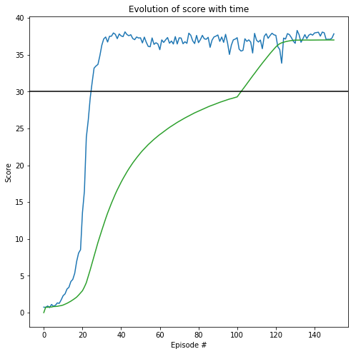

# Continuous Control

---

In this notebook, you will learn how to use the Unity ML-Agents environment for the second project of the [Deep Reinforcement Learning Nanodegree](https://www.udacity.com/course/deep-reinforcement-learning-nanodegree--nd893) program.

### 1. Start the Environment

We begin by importing the necessary packages.  If the code cell below returns an error, please revisit the project instructions to double-check that you have installed [Unity ML-Agents](https://github.com/Unity-Technologies/ml-agents/blob/master/docs/Installation.md) and [NumPy](http://www.numpy.org/).


```python
!pip -q install ./python
```

    tensorflow 1.7.1 has requirement numpy>=1.13.3, but you'll have numpy 1.12.1 which is incompatible.
    ipython 6.5.0 has requirement prompt-toolkit<2.0.0,>=1.0.15, but you'll have prompt-toolkit 3.0.5 which is incompatible.


```python
from unityagents import UnityEnvironment
import numpy as np
```

Next, we will start the environment!  **_Before running the code cell below_**, change the `file_name` parameter to match the location of the Unity environment that you downloaded.

- **Mac**: `"path/to/Reacher.app"`
- **Windows** (x86): `"path/to/Reacher_Windows_x86/Reacher.exe"`
- **Windows** (x86_64): `"path/to/Reacher_Windows_x86_64/Reacher.exe"`
- **Linux** (x86): `"path/to/Reacher_Linux/Reacher.x86"`
- **Linux** (x86_64): `"path/to/Reacher_Linux/Reacher.x86_64"`
- **Linux** (x86, headless): `"path/to/Reacher_Linux_NoVis/Reacher.x86"`
- **Linux** (x86_64, headless): `"path/to/Reacher_Linux_NoVis/Reacher.x86_64"`

For instance, if you are using a Mac, then you downloaded `Reacher.app`.  If this file is in the same folder as the notebook, then the line below should appear as follows:
```
env = UnityEnvironment(file_name="Reacher.app")
```


```python
#env.close()
env = UnityEnvironment(file_name='/data/Reacher_Linux_NoVis/Reacher.x86_64')
```

    INFO:unityagents:
    'Academy' started successfully!
    Unity Academy name: Academy
            Number of Brains: 1
            Number of External Brains : 1
            Lesson number : 0
            Reset Parameters :
    		goal_speed -> 1.0
    		goal_size -> 5.0
    Unity brain name: ReacherBrain
            Number of Visual Observations (per agent): 0
            Vector Observation space type: continuous
            Vector Observation space size (per agent): 33
            Number of stacked Vector Observation: 1
            Vector Action space type: continuous
            Vector Action space size (per agent): 4
            Vector Action descriptions: , , , 


Environments contain **_brains_** which are responsible for deciding the actions of their associated agents. Here we check for the first brain available, and set it as the default brain we will be controlling from Python.


```python
# get the default brain
brain_name = env.brain_names[0]
brain = env.brains[brain_name]
```

### 2. Examine the State and Action Spaces

In this environment, a double-jointed arm can move to target locations. A reward of `+0.1` is provided for each step that the agent's hand is in the goal location. Thus, the goal of your agent is to maintain its position at the target location for as many time steps as possible.

The observation space consists of `33` variables corresponding to position, rotation, velocity, and angular velocities of the arm.  Each action is a vector with four numbers, corresponding to torque applicable to two joints.  Every entry in the action vector must be a number between `-1` and `1`.

Run the code cell below to print some information about the environment.


```python
# reset the environment
env_info = env.reset(train_mode=True)[brain_name]

# number of agents
num_agents = len(env_info.agents)
print('Number of agents:', num_agents)

# size of each action
action_size = brain.vector_action_space_size
print('Size of each action:', action_size)

# examine the state space 
states = env_info.vector_observations
state_size = states.shape[1]
print('There are {} agents. Each observes a state with length: {}'.format(states.shape[0], state_size))
print('The state for the first agent looks like:', states[0])
```

    Number of agents: 20
    Size of each action: 4
    There are 20 agents. Each observes a state with length: 33
    The state for the first agent looks like: [  0.00000000e+00  -4.00000000e+00   0.00000000e+00   1.00000000e+00
      -0.00000000e+00  -0.00000000e+00  -4.37113883e-08   0.00000000e+00
       0.00000000e+00   0.00000000e+00   0.00000000e+00   0.00000000e+00
       0.00000000e+00   0.00000000e+00  -1.00000000e+01   0.00000000e+00
       1.00000000e+00  -0.00000000e+00  -0.00000000e+00  -4.37113883e-08
       0.00000000e+00   0.00000000e+00   0.00000000e+00   0.00000000e+00
       0.00000000e+00   0.00000000e+00   5.75471878e+00  -1.00000000e+00
       5.55726624e+00   0.00000000e+00   1.00000000e+00   0.00000000e+00
      -1.68164849e-01]


### 3. Take Random Actions in the Environment

In the next code cell, you will learn how to use the Python API to control the agent and receive feedback from the environment.

Once this cell is executed, you will watch the agent's performance, if it selects an action at random with each time step.  A window should pop up that allows you to observe the agent, as it moves through the environment.  

Of course, as part of the project, you'll have to change the code so that the agent is able to use its experience to gradually choose better actions when interacting with the environment!


```python
#env_info = env.reset(train_mode=False)[brain_name]     # reset the environment    
#states = env_info.vector_observations                  # get the current state (for each agent)
#scores = np.zeros(num_agents)                          # initialize the score (for each agent)
#while True:
#    actions = np.random.randn(num_agents, action_size) # select an action (for each agent)
#    actions = np.clip(actions, -1, 1)                  # all actions between -1 and 1
#    env_info = env.step(actions)[brain_name]           # send all actions to tne environment
#    next_states = env_info.vector_observations         # get next state (for each agent)
#    rewards = env_info.rewards                         # get reward (for each agent)
#    dones = env_info.local_done                        # see if episode finished
#    scores += env_info.rewards                         # update the score (for each agent)
#    states = next_states                               # roll over states to next time step
#    if np.any(dones):                                  # exit loop if episode finished
#        break
#print('Total score (averaged over agents) this episode: {}'.format(np.mean(scores)))
```

When finished, you can close the environment.


```python
#env.close()
```

### 4. It's Your Turn!

Now it's your turn to train your own agent to solve the environment!  When training the environment, set `train_mode=True`, so that the line for resetting the environment looks like the following:
```python
env_info = env.reset(train_mode=True)[brain_name]
```

# Continous Control - Student's project work

The following sections show my code and results from my work on this project.

I have implemented an Actor-Critic network with a DDPG algorithm:

Implementation follows the standard actor network implementation as described in the Udacity course videos regarding the DDPG algorithms. i.e. the bipedal walker or the pendulum exercises.

 - Actor neural network with three fully connected layers with sizes of: 33 (states) -> 256 (hidden) -> 128 (hidden) -> 4 (action value)
 - Critic neural network with three fully connected layers with sizes of: 33 (states) -> 256 (hidden) + 4 (action values) -> 128 (hidden) -> 1 (Q-value)
 
Both neural network architectures implement:
 - Linear fully connected layers: https://pytorch.org/docs/master/generated/torch.nn.Linear.html
 - Leaky rectangular linear unit activation function: https://pytorch.org/docs/stable/nn.html
 - Dropout between fully connected layersfor regularization: https://pytorch.org/docs/master/generated/torch.nn.Dropout.html
 
I have implemented (inspired by https://github.com/PHRABAL/DRL-Reacher for a time when I got stuck) an agent with:

 - Standard Deep Deterministic Policy Gradient Algorithm
 - Standard experience replay with random sampling
 - Standard Ornstein-Uhlenbeck process for noise on action value
 - Standard Mean-squared-error loss functions
 - Adam optimizer: https://pytorch.org/docs/stable/_modules/torch/optim/adam.html#Adam
 
Note that these implementations give room for many moer advanced changes, which of some will be discussed in the Final conclusions section.

I evolve the solution further until a minimum of 150 episodes, because I wanted to see if the results remain stable.

### Import all necessary packages at once


```python
# Import packages for the data processing before and after simulations
import time
import pickle
import math
import datetime
import random
import sys
import copy
import numpy as np
from collections import namedtuple, deque
import matplotlib.pyplot as plt
%matplotlib inline

# Import from PyTorch for neural network implementation
import torch
import torch.nn as nn
import torch.nn.functional as F
import torch.optim as optim

# Import to keep instance active while training on GPU
import workspace_utils
from workspace_utils import active_session
```

### Setting of variables for the neural network, training algorithms and unity environments


```python
BUFFER_SIZE = int(1e5)     # replay buffer size
BATCH_SIZE = 128           # minibatch size
GAMMA = 0.99               # discount factor
TAU = 0.001                # for soft update of target parameters
LR = 0.0001                # learning rate for both networks

FC_SIZE = 32               # number of neurons in layer of neural network
P_DROPOUT = 0.0            # dropout probability for neurons and network regularization

ACTION_SIZE = brain.vector_action_space_size # number of actions
STATE_SIZE = states.shape[1]    # number of states
N_AGENTS = len(env_info.agents) # number of agents

N_EPISODES = 2000          # number of maximum episodes for training
MAX_T = 1000               # maximum time agent is in the environment in each episode

ENV_SOLVED = 30.0          # average score of agent to consider environment solved
RANDOM_SEED = 5            # seed integer for random number generator
MIN_EPISODES = 150         # minimum number of episodes to train
```

### Check if training on GPU is possible, else use CPU


```python
# If GPU is available use for training otherwise use CPU
device = torch.device("cuda:0" if torch.cuda.is_available() else "cpu")

if device == "cpu":
    print("Available: CPU only")
else:
    print("Available: GPU cuda")
```

    Available: GPU cuda


### Implementation of noise process added to actions of agent

Implementation follows the standard noise Ornstein-Uhlenbeck process as described in the Udacity course videos regarding the DDPG algorithms. i.e. the bipedal walker or the pendulum exercises.


```python
#Ornstein-Uhlenbeck stochastic noise process
class OUNoise:

    def __init__(self):

        self.theta = 0.15
        self.sigma = 0.2
        self.size = (N_AGENTS, ACTION_SIZE)
        self.mu = np.zeros(self.size) # mu = 0.0
        self.reset()

    # Reset internal state to mean
    def reset(self):

        self.state = copy.copy(self.mu)

    # Update internal state and generate noise sample
    def sample(self):

        x = self.state
        dx = self.theta * (self.mu - x) + self.sigma * np.random.standard_normal(self.size)
        self.state = x + dx
        
        return self.state
```

### Implementation of experience replay buffer

Implementation follows the standard replay buffer implementation as described in the Udacity course videos regarding the DDPG algorithms. i.e. the bipedal walker or the pendulum exercises.


```python
class ReplayBuffer:

    def __init__(self):

        self.memory = deque(maxlen = BUFFER_SIZE)
        self.experience = namedtuple("Experience", field_names=["state", "action", "reward", "next_state", "done"])
        self.seed = random.seed(RANDOM_SEED)
    
    # Add an experience to the memory
    def add(self, state, action, reward, next_state, done):

        e = self.experience(state, action, reward, next_state, done)
        self.memory.append(e)
    
    # Randomly sample experiences from the memory
    def sample(self):

        # Randomly draw a sample of size BATCH_SIZE
        experiences = random.sample(self.memory, k=BATCH_SIZE)

        states = torch.from_numpy(np.vstack([e.state for e in experiences if e is not None])).float().to(device)
        actions = torch.from_numpy(np.vstack([e.action for e in experiences if e is not None])).float().to(device)
        rewards = torch.from_numpy(np.vstack([e.reward for e in experiences if e is not None])).float().to(device)
        next_states = torch.from_numpy(np.vstack([e.next_state for e in experiences if e is not None])).float().to(device)
        dones = torch.from_numpy(np.vstack([e.done for e in experiences if e is not None]).astype(np.uint8)).float().to(device)

        return (states, actions, rewards, next_states, dones)

    # Calculate length of memory
    def __len__(self):

        return len(self.memory)
```

### Initialization of weights in hidden layer

Implementation follows the standard weight implementation as described in the Udacity course videos regarding the DDPG algorithms. i.e. the bipedal walker or the pendulum exercises.


```python
def hidden_init(layer):
    
    fan_in = layer.weight.data.size()[0]
    lim = 1.0 / np.sqrt(fan_in)
    
    return (-lim, lim)
```

### Actor network for Actor-Critic-setup

Implementation follows the standard actor network implementation as described in the Udacity course videos regarding the DDPG algorithms. i.e. the bipedal walker or the pendulum exercises.

Standard neural network with three fully connected layers with sizes of: 33 (states) -> 256 (hidden) -> 128 (hidden) -> 4 (action value)

 - Linear fully connected layers: https://pytorch.org/docs/master/generated/torch.nn.Linear.html
 - Leaky rectangular linear unit activation function: https://pytorch.org/docs/stable/nn.html
 - Dropout between fully connected layersfor regularization: https://pytorch.org/docs/master/generated/torch.nn.Dropout.html


```python
class Actor(nn.Module):

    def __init__(self):

        super(Actor, self).__init__()
        
        self.seed = torch.manual_seed(RANDOM_SEED)
        
        self.fc1 = nn.Linear(STATE_SIZE, 8*FC_SIZE)
        self.fc2 = nn.Linear(8*FC_SIZE, 4*FC_SIZE)
        self.fc3 = nn.Linear(4*FC_SIZE, ACTION_SIZE)
        
        self.dropout = nn.Dropout(P_DROPOUT)
        
        self.reset_parameters()

    def reset_parameters(self):
        
        self.fc1.weight.data.uniform_(*hidden_init(self.fc1))
        self.fc2.weight.data.uniform_(*hidden_init(self.fc2))
        self.fc3.weight.data.uniform_(-3e-3, 3e-3)

    def forward(self, state):

        x = F.leaky_relu(self.fc1(state))
        
        x = F.leaky_relu(self.fc2(x))
        x = self.dropout(x) # dropout regularization
        
        result = torch.tanh(self.fc3(x)) # tanh to yield continous value between -1.0 and 1.0
        return result
```

### Critic network for Actor-Critic-setup

Implementation follows the standard critic network implementation as described in the Udacity course videos regarding the DDPG algorithms. i.e. the bipedal walker or the pendulum exercises.

Standard neural network with three fully connected layers with sizes of: 33 (states) -> 256 (hidden) + 4 (action values) -> 128 (hidden) -> 1 (Q-value)

 - Linear fully connected layers: https://pytorch.org/docs/master/generated/torch.nn.Linear.html
 - Leaky rectangular linear unit activation function: https://pytorch.org/docs/stable/nn.html
 - Dropout between fully connected layersfor regularization: https://pytorch.org/docs/master/generated/torch.nn.Dropout.html
 
Note, that at the first hidden layer, the action values are added into the network.


```python
class Critic(nn.Module):

    def __init__(self):

        super(Critic, self).__init__()
        
        self.seed = torch.manual_seed(RANDOM_SEED)
        
        self.fc1 = nn.Linear(STATE_SIZE, 8*FC_SIZE)
        self.fc2 = nn.Linear(8*FC_SIZE + ACTION_SIZE, 4*FC_SIZE)
        self.fc3 = nn.Linear(4*FC_SIZE, 1)
        
        self.dropout = nn.Dropout(P_DROPOUT)
        
        self.reset_parameters()

    def reset_parameters(self):
        
        self.fc1.weight.data.uniform_(*hidden_init(self.fc1))
        self.fc2.weight.data.uniform_(*hidden_init(self.fc2))
        self.fc3.weight.data.uniform_(-3e-3, 3e-3)

    def forward(self, state, action):

        xs = F.leaky_relu(self.fc1(state))
        x = torch.cat((xs, action), dim=1) # merge action vector into network

        x = F.leaky_relu(self.fc2(x))
        x = self.dropout(x) # dropout regularization
        
        result = self.fc3(x) # no activation as we need a real Q value
        return result
```

### Implementation of agent

Implementation of agent follows the standard implementation of DDPF as described in the Udacity course videos regarding the Bipedal Walker or the Pendulum and given in their corresponding Jupyter Notebooks.

Standard implementation using:

 - Standard Actor Critic network with three fully connected layers, leaky rectangular linear unig and dropout regularization
 - Standard Deep Deterministic Policy Gradient Algorithm
 - Standard experience replay with random sampling
 - Standard Ornstein-Uhlenbeck process for noise on action value
 - Standard Mean-squared-error loss functions
 - Adam optimizer: https://pytorch.org/docs/stable/_modules/torch/optim/adam.html#Adam
 - During implementation of agent I found it useful to be inspired by https://github.com/PHRABAL/DRL-Reacher


```python
class Agent():
    
    def __init__(self):

        self.seed = random.seed(RANDOM_SEED)

        # Actor Network (w/ Target Network)
        self.actor_local = Actor().to(device)
        self.actor_target = Actor().to(device)
        self.actor_optimizer = optim.Adam(self.actor_local.parameters(), lr=LR)

        # Critic Network (w/ Target Network)
        self.critic_local = Critic().to(device)
        self.critic_target = Critic().to(device)
        self.critic_optimizer = optim.Adam(self.critic_local.parameters(), lr=LR)

        # Noise process
        self.noise = OUNoise()

        # Replay memory
        self.memory = ReplayBuffer()
    
    # Perform step
    def step(self, state, action, reward, next_state, done):

        # Add to memory (for each agent)
        for agent in range(N_AGENTS):
            self.memory.add(state[agent,:], action[agent,:], reward[agent], next_state[agent,:], done[agent])

        # Learn from experiences
        if len(self.memory) > BATCH_SIZE:
            experiences = self.memory.sample()
            self.learn(experiences, GAMMA)

    # Choose action for agent according to given policy
    def act(self, states):

        states = torch.from_numpy(states).float().to(device)
        actions = np.zeros((N_AGENTS, ACTION_SIZE))
        
        self.actor_local.eval()
        
        with torch.no_grad():
            for agent, state in enumerate(states):
                action = self.actor_local(state).cpu().data.numpy()
                actions[agent, :] = action
                
        self.actor_local.train()
        
        actions += self.noise.sample()
        
        return np.clip(actions, -1, 1)

    # Reset noise
    def reset(self):
        self.noise.reset()

    # Learn from experiences
    def learn(self, experiences, gamma):

        states, actions, rewards, next_states, dones = experiences

        # Get next actions from actor and corresponding Q from critic
        actions_next = self.actor_target(next_states)
        Q_targets_next = self.critic_target(next_states, actions_next)
        
        # Calculate target Q
        Q_targets = rewards + (gamma * Q_targets_next * (1.0 - dones))
        
        # Get expected Q
        Q_expected = self.critic_local(states, actions)
        
        # Standard mean-sqaured-error loss function
        critic_loss = F.mse_loss(Q_expected, Q_targets)
        
        # Reset the gradients
        self.critic_optimizer.zero_grad()
        # Perform backpropagation
        critic_loss.backward()
        # Optimize weights
        self.critic_optimizer.step()

        
        # Compute loss function for actor
        actions_pred = self.actor_local(states)
        actor_loss = -self.critic_local(states, actions_pred).mean()

        # Reset the gradients
        self.actor_optimizer.zero_grad()
        # Perform backpropagation
        actor_loss.backward()
        # Optimize weights
        self.actor_optimizer.step()

        # Update networks
        self.soft_update(self.critic_local, self.critic_target)
        self.soft_update(self.actor_local, self.actor_target)                     

    def soft_update(self, local_model, target_model):

        for target_param, local_param in zip(target_model.parameters(), local_model.parameters()):
            target_param.data.copy_(TAU * local_param.data + (1.0 - TAU) * target_param.data)
```

### Training of agent with deep deterministic policy gradient

Algorithm loops over a number of eposiodes with maximum of N_EPISODES=2000 and minimum of MIN_EPISODES=150, each for a time until any of the 20 agents is done.

 - It is possible to output the weights every 50 episodes
 - The environment is considered solved if the average score (of all agents) is greater than ENV_SOLVED=30.0 for the last 100 episodes.
 - If the environment is solved, the training is stopped and the final weights are written in a file


```python
def ddpg():
    
    scores_window = deque(maxlen = 100)
    scores_all = []
    
    for i_episode in range(1, N_EPISODES + 1):
        
        env_info = env.reset(train_mode=True)[brain_name]      # reset the environment    
        states = env_info.vector_observations                  # get current state
        agent.reset()                                          # reset the agent
        scores = np.zeros(N_AGENTS)                            # reset scores
        
        while True:
            
            actions = agent.act(states)                        # select an action (for each agent)
            
            env_info = env.step(actions)[brain_name]           # send the action to the environment
            
            next_states = env_info.vector_observations         # get next state (for each agent)
            rewards = env_info.rewards                         # get reward (for each agent)
            dones = env_info.local_done                        # see if episode finished (for each agent)
            
            agent.step(states, actions, rewards, next_states, dones) # agent step
            
            scores += rewards                                  # update the score (for each agent)
            states = next_states                               # roll over states to next time step
            if np.any(dones):                                  # exit loop if episode finished
                break

        scores_window.append(np.mean(scores))                  # save most recent score
        scores_all.append(np.mean(scores))                     # save most recent score

        print('\rEpisode {}\tCurrent Score: {:.2f}\tAverage Score: {:.2f}'.format(i_episode, np.mean(scores), np.mean(scores_window)))
        
        # Output temporary weights file every 50 episodes.
        #if i_episode % 50 == 0:
        #    print('\rEpisode {}\tAverage Score: {:.2f}'.format(i_episode, np.mean(scores_window)))
        #    torch.save(agent.actor_local.state_dict(), 'checkpoint_actor_temp.pth')
        #    torch.save(agent.critic_local.state_dict(), 'checkpoint_critic_temp.pth')
        
        # Output final weights after environment is solved
        if np.mean(scores_window) > ENV_SOLVED:
            print('\nEnvironment solved in {:d} episodes!\tAverage Score: {:.2f}'.format(i_episode, np.mean(scores_window)))
            torch.save(agent.actor_local.state_dict(), 'checkpoint_actor.pth')
            torch.save(agent.critic_local.state_dict(), 'checkpoint_critic.pth')
            if i_episode > MIN_EPISODES:
                break

    return scores_all
```


```python
if device == "cpu":
    print("Running on CPU.")
else:
    print("Running on GPU.")
```

    Running on GPU.


### Main Loop

In the following cell all the previous implementations come into play. The agent architecture is subsequently trained and the weights of the final solution as well as the time evolution of average reward are stored into files.


```python
print("\nTraining Loop:\n")

agent = Agent()

with active_session():
    scores = ddpg()

f = open('scores.pckl', 'wb')
pickle.dump(scores, f)
f.close()
```

    
    Training Loop:
    
    Episode 1	Current Score: 0.75	Average Score: 0.75
    Episode 2	Current Score: 0.71	Average Score: 0.73
    Episode 3	Current Score: 0.90	Average Score: 0.79
    Episode 4	Current Score: 0.68	Average Score: 0.76
    Episode 5	Current Score: 1.11	Average Score: 0.83
    Episode 6	Current Score: 0.87	Average Score: 0.84
    Episode 7	Current Score: 0.99	Average Score: 0.86
    Episode 8	Current Score: 1.32	Average Score: 0.92
    Episode 9	Current Score: 1.26	Average Score: 0.95
    Episode 10	Current Score: 1.73	Average Score: 1.03
    Episode 11	Current Score: 2.30	Average Score: 1.15
    Episode 12	Current Score: 2.54	Average Score: 1.26
    Episode 13	Current Score: 3.20	Average Score: 1.41
    Episode 14	Current Score: 3.44	Average Score: 1.56
    Episode 15	Current Score: 4.22	Average Score: 1.73
    Episode 16	Current Score: 4.51	Average Score: 1.91
    Episode 17	Current Score: 5.34	Average Score: 2.11
    Episode 18	Current Score: 6.95	Average Score: 2.38
    Episode 19	Current Score: 8.08	Average Score: 2.68
    Episode 20	Current Score: 8.53	Average Score: 2.97
    Episode 21	Current Score: 13.58	Average Score: 3.48
    Episode 22	Current Score: 16.48	Average Score: 4.07
    Episode 23	Current Score: 23.79	Average Score: 4.92
    Episode 24	Current Score: 26.13	Average Score: 5.81
    Episode 25	Current Score: 29.11	Average Score: 6.74
    Episode 26	Current Score: 31.22	Average Score: 7.68
    Episode 27	Current Score: 33.18	Average Score: 8.63
    Episode 28	Current Score: 33.47	Average Score: 9.51
    Episode 29	Current Score: 33.68	Average Score: 10.35
    Episode 30	Current Score: 34.86	Average Score: 11.16
    Episode 31	Current Score: 36.28	Average Score: 11.97
    Episode 32	Current Score: 37.14	Average Score: 12.76
    Episode 33	Current Score: 37.40	Average Score: 13.51
    Episode 34	Current Score: 36.72	Average Score: 14.19
    Episode 35	Current Score: 37.51	Average Score: 14.86
    Episode 36	Current Score: 37.51	Average Score: 15.49
    Episode 37	Current Score: 37.95	Average Score: 16.09
    Episode 38	Current Score: 37.77	Average Score: 16.66
    Episode 39	Current Score: 37.18	Average Score: 17.19
    Episode 40	Current Score: 37.82	Average Score: 17.71
    Episode 41	Current Score: 37.55	Average Score: 18.19
    Episode 42	Current Score: 37.45	Average Score: 18.65
    Episode 43	Current Score: 38.10	Average Score: 19.10
    Episode 44	Current Score: 37.74	Average Score: 19.52
    Episode 45	Current Score: 37.58	Average Score: 19.93
    Episode 46	Current Score: 37.71	Average Score: 20.31
    Episode 47	Current Score: 37.20	Average Score: 20.67
    Episode 48	Current Score: 37.04	Average Score: 21.01
    Episode 49	Current Score: 37.41	Average Score: 21.35
    Episode 50	Current Score: 37.27	Average Score: 21.67
    Episode 51	Current Score: 37.29	Average Score: 21.97
    Episode 52	Current Score: 36.60	Average Score: 22.25
    Episode 53	Current Score: 37.39	Average Score: 22.54
    Episode 54	Current Score: 36.68	Average Score: 22.80
    Episode 55	Current Score: 36.13	Average Score: 23.04
    Episode 56	Current Score: 36.08	Average Score: 23.28
    Episode 57	Current Score: 37.28	Average Score: 23.52
    Episode 58	Current Score: 36.40	Average Score: 23.74
    Episode 59	Current Score: 36.62	Average Score: 23.96
    Episode 60	Current Score: 36.46	Average Score: 24.17
    Episode 61	Current Score: 35.68	Average Score: 24.36
    Episode 62	Current Score: 37.01	Average Score: 24.56
    Episode 63	Current Score: 36.67	Average Score: 24.76
    Episode 64	Current Score: 37.02	Average Score: 24.95
    Episode 65	Current Score: 37.33	Average Score: 25.14
    Episode 66	Current Score: 36.56	Average Score: 25.31
    Episode 67	Current Score: 36.86	Average Score: 25.48
    Episode 68	Current Score: 36.45	Average Score: 25.64
    Episode 69	Current Score: 37.45	Average Score: 25.82
    Episode 70	Current Score: 36.46	Average Score: 25.97
    Episode 71	Current Score: 37.29	Average Score: 26.13
    Episode 72	Current Score: 37.26	Average Score: 26.28
    Episode 73	Current Score: 36.49	Average Score: 26.42
    Episode 74	Current Score: 36.77	Average Score: 26.56
    Episode 75	Current Score: 36.54	Average Score: 26.69
    Episode 76	Current Score: 37.92	Average Score: 26.84
    Episode 77	Current Score: 37.65	Average Score: 26.98
    Episode 78	Current Score: 36.89	Average Score: 27.11
    Episode 79	Current Score: 36.52	Average Score: 27.23
    Episode 80	Current Score: 37.62	Average Score: 27.36
    Episode 81	Current Score: 36.64	Average Score: 27.47
    Episode 82	Current Score: 37.06	Average Score: 27.59
    Episode 83	Current Score: 37.63	Average Score: 27.71
    Episode 84	Current Score: 37.16	Average Score: 27.82
    Episode 85	Current Score: 37.10	Average Score: 27.93
    Episode 86	Current Score: 37.36	Average Score: 28.04
    Episode 87	Current Score: 36.00	Average Score: 28.13
    Episode 88	Current Score: 36.97	Average Score: 28.23
    Episode 89	Current Score: 37.41	Average Score: 28.34
    Episode 90	Current Score: 37.52	Average Score: 28.44
    Episode 91	Current Score: 37.68	Average Score: 28.54
    Episode 92	Current Score: 36.81	Average Score: 28.63
    Episode 93	Current Score: 37.40	Average Score: 28.72
    Episode 94	Current Score: 36.68	Average Score: 28.81
    Episode 95	Current Score: 37.76	Average Score: 28.90
    Episode 96	Current Score: 36.62	Average Score: 28.98
    Episode 97	Current Score: 35.04	Average Score: 29.05
    Episode 98	Current Score: 36.31	Average Score: 29.12
    Episode 99	Current Score: 37.02	Average Score: 29.20
    Episode 100	Current Score: 37.12	Average Score: 29.28
    Episode 101	Current Score: 37.31	Average Score: 29.64
    Episode 102	Current Score: 35.76	Average Score: 30.00
    Episode 103	Current Score: 35.49	Average Score: 30.34
    
    Environment solved in 103 episodes!	Average Score: 30.34
    Episode 104	Current Score: 35.59	Average Score: 30.69
    
    Environment solved in 104 episodes!	Average Score: 30.69
    Episode 105	Current Score: 37.16	Average Score: 31.05
    
    Environment solved in 105 episodes!	Average Score: 31.05
    Episode 106	Current Score: 36.81	Average Score: 31.41
    
    Environment solved in 106 episodes!	Average Score: 31.41
    Episode 107	Current Score: 37.01	Average Score: 31.77
    
    Environment solved in 107 episodes!	Average Score: 31.77
    Episode 108	Current Score: 36.72	Average Score: 32.12
    
    Environment solved in 108 episodes!	Average Score: 32.12
    Episode 109	Current Score: 35.23	Average Score: 32.46
    
    Environment solved in 109 episodes!	Average Score: 32.46
    Episode 110	Current Score: 37.90	Average Score: 32.83
    
    Environment solved in 110 episodes!	Average Score: 32.83
    Episode 111	Current Score: 36.97	Average Score: 33.17
    
    Environment solved in 111 episodes!	Average Score: 33.17
    Episode 112	Current Score: 36.72	Average Score: 33.51
    
    Environment solved in 112 episodes!	Average Score: 33.51
    Episode 113	Current Score: 36.99	Average Score: 33.85
    
    Environment solved in 113 episodes!	Average Score: 33.85
    Episode 114	Current Score: 35.82	Average Score: 34.18
    
    Environment solved in 114 episodes!	Average Score: 34.18
    Episode 115	Current Score: 37.50	Average Score: 34.51
    
    Environment solved in 115 episodes!	Average Score: 34.51
    Episode 116	Current Score: 37.85	Average Score: 34.84
    
    Environment solved in 116 episodes!	Average Score: 34.84
    Episode 117	Current Score: 37.23	Average Score: 35.16
    
    Environment solved in 117 episodes!	Average Score: 35.16
    Episode 118	Current Score: 37.60	Average Score: 35.47
    
    Environment solved in 118 episodes!	Average Score: 35.47
    Episode 119	Current Score: 37.91	Average Score: 35.77
    
    Environment solved in 119 episodes!	Average Score: 35.77
    Episode 120	Current Score: 37.70	Average Score: 36.06
    
    Environment solved in 120 episodes!	Average Score: 36.06
    Episode 121	Current Score: 37.62	Average Score: 36.30
    
    Environment solved in 121 episodes!	Average Score: 36.30
    Episode 122	Current Score: 36.10	Average Score: 36.49
    
    Environment solved in 122 episodes!	Average Score: 36.49
    Episode 123	Current Score: 35.71	Average Score: 36.61
    
    Environment solved in 123 episodes!	Average Score: 36.61
    Episode 124	Current Score: 33.85	Average Score: 36.69
    
    Environment solved in 124 episodes!	Average Score: 36.69
    Episode 125	Current Score: 37.26	Average Score: 36.77
    
    Environment solved in 125 episodes!	Average Score: 36.77
    Episode 126	Current Score: 37.13	Average Score: 36.83
    
    Environment solved in 126 episodes!	Average Score: 36.83
    Episode 127	Current Score: 37.86	Average Score: 36.88
    
    Environment solved in 127 episodes!	Average Score: 36.88
    Episode 128	Current Score: 37.73	Average Score: 36.92
    
    Environment solved in 128 episodes!	Average Score: 36.92
    Episode 129	Current Score: 37.33	Average Score: 36.96
    
    Environment solved in 129 episodes!	Average Score: 36.96
    Episode 130	Current Score: 36.85	Average Score: 36.98
    
    Environment solved in 130 episodes!	Average Score: 36.98
    Episode 131	Current Score: 36.55	Average Score: 36.98
    
    Environment solved in 131 episodes!	Average Score: 36.98
    Episode 132	Current Score: 38.29	Average Score: 36.99
    
    Environment solved in 132 episodes!	Average Score: 36.99
    Episode 133	Current Score: 37.71	Average Score: 36.99
    
    Environment solved in 133 episodes!	Average Score: 36.99
    Episode 134	Current Score: 36.69	Average Score: 36.99
    
    Environment solved in 134 episodes!	Average Score: 36.99
    Episode 135	Current Score: 37.17	Average Score: 36.99
    
    Environment solved in 135 episodes!	Average Score: 36.99
    Episode 136	Current Score: 37.73	Average Score: 36.99
    
    Environment solved in 136 episodes!	Average Score: 36.99
    Episode 137	Current Score: 37.19	Average Score: 36.99
    
    Environment solved in 137 episodes!	Average Score: 36.99
    Episode 138	Current Score: 37.64	Average Score: 36.98
    
    Environment solved in 138 episodes!	Average Score: 36.98
    Episode 139	Current Score: 37.81	Average Score: 36.99
    
    Environment solved in 139 episodes!	Average Score: 36.99
    Episode 140	Current Score: 37.65	Average Score: 36.99
    
    Environment solved in 140 episodes!	Average Score: 36.99
    Episode 141	Current Score: 37.95	Average Score: 36.99
    
    Environment solved in 141 episodes!	Average Score: 36.99
    Episode 142	Current Score: 38.00	Average Score: 37.00
    
    Environment solved in 142 episodes!	Average Score: 37.00
    Episode 143	Current Score: 38.05	Average Score: 37.00
    
    Environment solved in 143 episodes!	Average Score: 37.00
    Episode 144	Current Score: 37.53	Average Score: 37.00
    
    Environment solved in 144 episodes!	Average Score: 37.00
    Episode 145	Current Score: 38.07	Average Score: 37.00
    
    Environment solved in 145 episodes!	Average Score: 37.00
    Episode 146	Current Score: 37.98	Average Score: 37.00
    
    Environment solved in 146 episodes!	Average Score: 37.00
    Episode 147	Current Score: 37.07	Average Score: 37.00
    
    Environment solved in 147 episodes!	Average Score: 37.00
    Episode 148	Current Score: 37.10	Average Score: 37.00
    
    Environment solved in 148 episodes!	Average Score: 37.00
    Episode 149	Current Score: 37.09	Average Score: 37.00
    
    Environment solved in 149 episodes!	Average Score: 37.00
    Episode 150	Current Score: 37.25	Average Score: 37.00
    
    Environment solved in 150 episodes!	Average Score: 37.00
    Episode 151	Current Score: 37.84	Average Score: 37.00
    
    Environment solved in 151 episodes!	Average Score: 37.00


The average scores are loaded back from files and plotted.


```python
# Definition of helper function to calculate rolling mean
def runningMean(y, N):
    x = np.asarray(y)
    result = np.zeros(len(x))
    for i in range(1,len(x)):
        if i < int(N):
            result[i] = np.mean(x[0:i]) # Fill up first data points where index is smaller than window size
        else:
            result[i] = np.mean(x[i-N:i]) # Calculate rolling mean where index is larger than window size
    return result

f = open('scores.pckl', 'rb')
scores = pickle.load(f)
f.close()
```


```python
# Calculate average scores of all four Agents with the same window=100 as used in the Q-learning algorithm
mean_score= runningMean(scores, 100)

# Show averages of all fou agents in a single plot for comparison
fig = plt.figure(figsize=(8,8))
ax = fig.add_subplot(111)
plt.plot(np.arange(len(scores)), scores, 'tab:blue')
plt.plot(np.arange(len(mean_score)), mean_score, 'tab:green')

plt.axhline(y=30.0, color="Black")

plt.title('Evolution of score with time')
plt.xlabel('Episode #')
plt.ylabel('Score')
plt.show()
```





# Conclusions and future improvements

In this project I have implemented an Agent using the DDPG algorithm to solve the Unity Reacher Environment with 20 parallel agents.

The performance is as follows:

 - The 20-Agent set-up requires 102 episodes to solve the problem. I evolved even further the simulation up to 150 episodes and the results remained stable.
    
After trying to solve the single agent environment for some days, I have choosen to instead focus on the 20 agent environment and found it more e asy to solve. I believe, that because from 20 parallel agents more experiences are gathered early on in the simulations. Therefore, the Experience Replay Buffer contains samples of higher quality and learning improves. This might cause the exponentially looking increase of reward, before it reaches a plateau. Furthermore, since we are taknig the average score of all 20 agents, the impact of some suboptimally performing agents will be averaged out.

The environment was solved with a simple version of the Deep Deterministic Policy Gradient Algorithm. Also the architecture of the neural network contained a simple size of 128 to 256 neurons. I found during training that networks with larger numbers of neurons (i.e. > 1024) do not perform well at all in this task. The simpler the easier approach seems to work well.

In the future, it would very well be worthwhile to try some of the following improvements and algorithmic choices:

At first, it might be worhtwhile to try the RainBow https://arxiv.org/abs/1710.02298 implementation of DeepMind, which combines even more improvements for Deep Reinforcement Learning. Also in my first project "navigation" I have used the prioritized experience replay buffer of: https://arxiv.org/abs/1511.05952 together with a weighted mean squared error loss functions.

Secondly, it is suggested to tryout the possible algorithms: DQN, C51, A2C, QR-DQN, PPO, OC, TD3, etc.
A good overview of these possible implementations is given by Shangtong Zhang: https://github.com/ShangtongZhang/DeepRL

Of course, at last, a complete study of exploration of the hyperparameter space is necessary, which would lead to some questions like this: How many layers perform best? How many neurons? Which activation functions? Linear or exponential epsilon decay? How to choose the discount factor for reward?

We have included a helper function (Stochastic noise process), which can also be subject to further studies, such as varying its hyperparameters or decaying the noise with time.

More ideas:

 - Port the algorithm into C++...
 - Run the training on Nvidia Jetson...


```python

```
